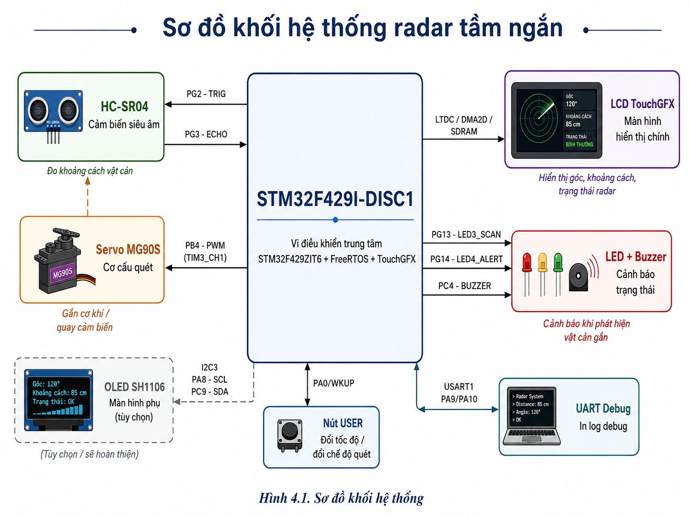
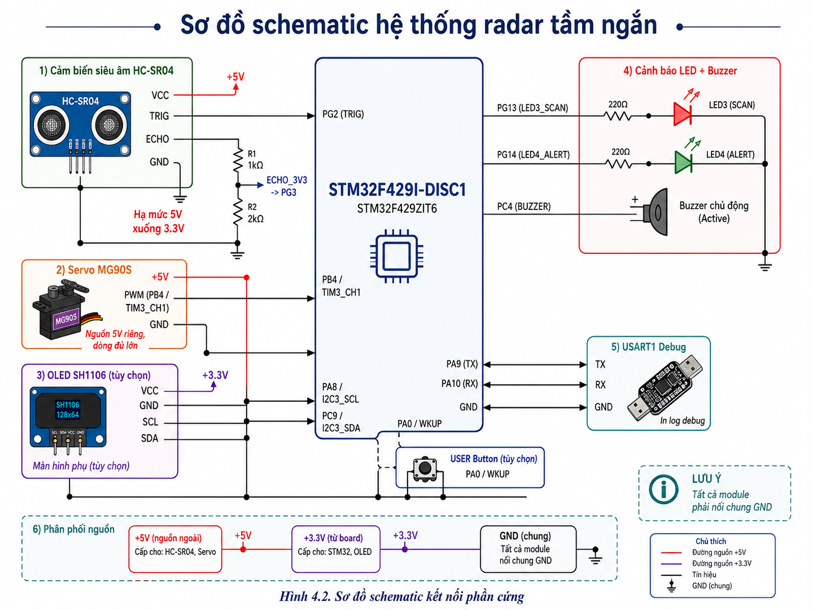

# Radar tầm ngắn - STM32F429I-DISC1 + TouchGFX

> Báo cáo bài tập lớn môn Hệ nhúng: xây dựng mô hình radar tầm ngắn sử dụng STM32F429I-DISC1, cảm biến siêu âm HC-SR04, servo MG90S và giao diện TouchGFX.

## Tóm tắt

Dự án triển khai một hệ thống quét vật cản tầm ngắn theo mô hình radar. Cảm biến HC-SR04 được gắn trên servo MG90S để thay đổi góc quét, STM32F429I-DISC1 đọc tín hiệu echo, tính khoảng cách, xử lý ngưỡng phát hiện và hiển thị trạng thái trên màn hình LCD TouchGFX tích hợp của board.

Hệ thống có các chức năng chính: quét theo góc, đo khoảng cách vật cản, hiển thị góc/khoảng cách/trạng thái, đổi chế độ quét, đổi tốc độ quét và cảnh báo bằng LED/buzzer khi vật ở vùng gần. Project chính nằm trong thư mục [`radar_short_range_touchgfx`](./radar_short_range_touchgfx).

> [!NOTE]
> Báo cáo ưu tiên thông tin đã kiểm chứng từ repo và file cấu hình. Các mục cần minh chứng thực nghiệm như ảnh, video, bảng đo và phần OLED SH1106 vẫn được giữ `TODO` để nhóm bổ sung sau, tránh mô tả vượt quá dữ liệu hiện có.

## Mục lục

- [1. GIỚI THIỆU](#1-giới-thiệu)
- [2. TÁC GIẢ](#2-tác-giả)
- [3. MÔI TRƯỜNG HOẠT ĐỘNG](#3-môi-trường-hoạt-động)
- [4. SƠ ĐỒ SCHEMATIC / KẾT NỐI PHẦN CỨNG](#4-sơ-đồ-schematic--kết-nối-phần-cứng)
- [5. NGUYÊN LÝ HOẠT ĐỘNG](#5-nguyên-lý-hoạt-động)
- [6. TÍCH HỢP HỆ THỐNG](#6-tích-hợp-hệ-thống)
- [7. KIẾN TRÚC PHẦN MỀM](#7-kiến-trúc-phần-mềm)
- [8. ĐẶC TẢ HÀM / MODULE QUAN TRỌNG](#8-đặc-tả-hàm--module-quan-trọng)
- [9. KẾT QUẢ](#9-kết-quả)
- [10. ĐÁNH GIÁ THỰC TẾ VÀ GIỚI HẠN](#10-đánh-giá-thực-tế-và-giới-hạn)
- [11. KHÓ KHĂN VÀ KINH NGHIỆM RÚT RA](#11-khó-khăn-và-kinh-nghiệm-rút-ra)
- [12. HƯỚNG PHÁT TRIỂN](#12-hướng-phát-triển)
- [13. TÀI LIỆU THAM KHẢO](#13-tài-liệu-tham-khảo)
- [14. KẾT LUẬN NGẮN](#14-kết-luận-ngắn)

## 1. GIỚI THIỆU

### 1.1. Tên đề tài

**Radar tầm ngắn**

### 1.2. Mục tiêu

Mục tiêu của đề tài là thiết kế và triển khai một hệ thống nhúng có khả năng:

- Quét khu vực phía trước cảm biến theo một dải góc xác định.
- Đo khoảng cách vật cản bằng cảm biến siêu âm HC-SR04.
- Điều khiển servo MG90S để thay đổi hướng quét.
- Hiển thị trực quan trạng thái radar trên LCD TouchGFX của STM32F429I-DISC1.
- Cảnh báo bằng LED và buzzer khi phát hiện vật thể trong vùng gần.
- Cho phép thay đổi tốc độ quét và chế độ quét thông qua giao diện hoặc nút USER.

### 1.3. Ý tưởng hệ thống

Hệ thống không phải radar RF theo nghĩa vật lý, mà là một mô hình radar tầm ngắn dùng cảm biến siêu âm để mô phỏng quá trình quét và phát hiện vật cản. Servo quay cảm biến HC-SR04 qua từng góc; tại mỗi góc, STM32 phát xung trigger, đo độ rộng xung echo, tính khoảng cách và cập nhật dữ liệu cho giao diện TouchGFX.

Luồng xử lý tổng quát:

1. Servo được đặt tới góc quét hiện tại.
2. STM32 phát xung trigger 10 us tới HC-SR04.
3. Echo được bắt bằng ngắt ngoài EXTI3 trên chân PG3.
4. Phần mềm tính thời gian echo và suy ra khoảng cách.
5. Logic ứng dụng xác định trạng thái `SCAN`, `DETECT` hoặc `ALERT`.
6. LCD TouchGFX, LED và buzzer được cập nhật theo trạng thái mới.
7. Góc quét được tăng/giảm để tiếp tục chu kỳ quét.

### 1.4. Chức năng chính

| Nhóm chức năng | Mô tả |
| --- | --- |
| Đo khoảng cách | Đo khoảng cách bằng HC-SR04, xử lý echo bằng EXTI và DWT cycle counter. |
| Quét góc | Điều khiển servo MG90S bằng PWM TIM3_CH1 trên PB4. |
| Hiển thị LCD | Giao diện TouchGFX hiển thị góc, khoảng cách, trạng thái và vị trí mục tiêu. |
| Chế độ quét | Hỗ trợ chế độ quét 90 độ và 180 độ theo cấu hình trong `radar_config.h`. |
| Tốc độ quét | Hỗ trợ các mức `SLOW`, `MED`, `FAST`. |
| Cảnh báo | LED/buzzer phản hồi theo trạng thái phát hiện vật cản và vật cản gần. |
| Điều khiển nút USER | Bấm ngắn đổi tốc độ; giữ lâu đổi chế độ quét. |
| Debug UART | In trạng thái đo, echo, counter và dữ liệu UI qua USART1. |

### 1.5. Cấu trúc project chính

```text
IT4210/
|-- README.md
|-- REPORT_PLAN.md
`-- radar_short_range_touchgfx/
    |-- Core/
    |-- Drivers/
    |-- Middlewares/
    |-- STM32CubeIDE/
    |-- TouchGFX/
    |-- DesignAssets/
    `-- STM32F429I_DISCO_REV_D01.ioc
```

## 2. TÁC GIẢ

### 2.1. Thành viên nhóm

| STT | MSSV | Họ và tên | Email |
| ---: | --- | --- | --- |
| 1 | 20235318 | Nguyễn Minh Giang | giang.nm235318@sis.hust.edu.vn |
| 2 | 20235333 | Bùi Trung Hoàng | hoang.bt235333@sis.hust.edu.vn |
| 3 | 20235342 | Phạm Ngọc Hưng | hung.pn235342@sis.hust.edu.vn |
| 4 | 20235421 | Khương Anh Tài | tai.ka235421@sis.hust.edu.vn |

### 2.2. Phân công công việc

> [!IMPORTANT]
> Repo hiện chưa có dữ liệu đủ chắc để kết luận chi tiết phân công từng thành viên. Bảng dưới đây được tạo sẵn để nhóm điền trước khi nộp báo cáo.

| Thành viên | Công việc chính | Ghi chú |
| --- | --- | --- |
| Nguyễn Minh Giang | TODO: Điền phần việc thực hiện | TODO |
| Bùi Trung Hoàng | TODO: Điền phần việc thực hiện | TODO |
| Phạm Ngọc Hưng | TODO: Điền phần việc thực hiện | TODO |
| Khương Anh Tài | TODO: Điền phần việc thực hiện | TODO |

## 3. MÔI TRƯỜNG HOẠT ĐỘNG

### 3.1. Board STM32F429I-DISC1

Hệ thống sử dụng board **STM32F429I-DISC1** làm nền tảng điều khiển trung tâm. Vi điều khiển chính là **STM32F429ZIT6**, thuộc dòng STM32F4, phù hợp với bài toán vừa điều khiển ngoại vi thời gian thực vừa chạy giao diện đồ họa nhúng.

Trong project này, board đảm nhiệm các vai trò:

- Khởi tạo và điều phối toàn bộ ngoại vi: GPIO, EXTI, TIM, I2C, UART, LTDC, DMA2D và FMC/SDRAM.
- Chạy **FreeRTOS CMSIS v2** để tách logic giao diện, logic radar và xử lý nút USER.
- Chạy **TouchGFX** trên LCD tích hợp của board để hiển thị giao diện radar.
- Điều khiển servo MG90S bằng PWM, đọc cảm biến HC-SR04 bằng ngắt ngoài và phát tín hiệu cảnh báo qua LED/buzzer.

Board STM32F429I-DISC1 có LCD và SDRAM tích hợp, đây là lợi thế cho giao diện TouchGFX nhưng cũng làm số chân trống bị hạn chế. Vì vậy pin mapping trong báo cáo phải bám sát file cấu hình [`STM32F429I_DISCO_REV_D01.ioc`](./radar_short_range_touchgfx/STM32F429I_DISCO_REV_D01.ioc) và file [`Core/Inc/main.h`](./radar_short_range_touchgfx/Core/Inc/main.h).

### 3.2. Các module sử dụng

| Nhóm | Module | Vai trò |
| --- | --- | --- |
| Điều khiển trung tâm | STM32F429I-DISC1 / STM32F429ZIT6 | Chạy firmware, FreeRTOS, TouchGFX và điều phối ngoại vi |
| Đo khoảng cách | HC-SR04 | Đo khoảng cách vật cản bằng sóng siêu âm |
| Cơ cấu quét | Servo MG90S | Quay cảm biến theo góc quét |
| Hiển thị chính | LCD tích hợp trên STM32F429I-DISC1 | Hiển thị giao diện radar bằng TouchGFX |
| Hiển thị phụ | OLED SH1106 I2C | TODO: xác nhận mức độ hoàn thiện driver/hình ảnh thực tế |
| Cảnh báo | Buzzer active | Phát cảnh báo âm thanh khi vật thể ở vùng gần |
| Chỉ thị trạng thái | LED on-board PG13/PG14 | Báo trạng thái quét và cảnh báo |
| Điều khiển nhanh | Nút USER PA0/WKUP | Bấm ngắn đổi tốc độ, giữ lâu đổi chế độ quét |
| Debug | USART1 PA9/PA10 | In log đo khoảng cách, echo, counter và dữ liệu UI |

### 3.3. Bill of Materials (BOM)

| STT | Linh kiện | Số lượng | Vai trò | Ghi chú kỹ thuật |
| ---: | --- | ---: | --- | --- |
| 1 | STM32F429I-DISC1 / STM32F429ZIT6 | 1 | Board điều khiển trung tâm | Có LCD, SDRAM, ST-LINK; project cấu hình TouchGFX, LTDC, DMA2D, FMC/SDRAM |
| 2 | HC-SR04 | 1 | Cảm biến đo khoảng cách | Trigger 10 us; echo đo bằng EXTI3 trên PG3; sóng siêu âm 40 kHz; cần lưu ý echo có thể ở mức 5 V |
| 3 | Servo MG90S | 1 | Quay cảm biến HC-SR04 theo góc quét | Điều khiển bằng PWM TIM3_CH1 trên PB4; cần nguồn đủ dòng, GND chung với STM32 |
| 4 | OLED SH1106 I2C | 1 | Màn hình phụ theo yêu cầu phần cứng | I2C3 SCL/SDA trên PA8/PC9; TODO: xác nhận driver OLED trong firmware |
| 5 | Buzzer active | 1 | Cảnh báo âm thanh | Điều khiển GPIO PC4; code hiện bật/tắt theo trạng thái cảnh báo gần |
| 6 | LED on-board | 2 | Chỉ thị scan và alert | PG13 là `LED3_SCAN`, PG14 là `LED4_ALERT` |
| 7 | LCD tích hợp trên board | 1 | Giao diện người dùng chính | TouchGFX 4.26.1, LTDC 240 x 320, RGB565 |
| 8 | Nút USER trên board | 1 | Điều khiển nhanh | PA0/WKUP; bấm ngắn đổi tốc độ, giữ lâu đổi mode 90/180 độ |
| 9 | Dây jumper / breadboard / dây nguồn | TODO | Đấu nối phần cứng | TODO: cập nhật theo ảnh đấu nối thực tế |
| 10 | Mạch chia áp hoặc level shifter cho Echo | TODO | Bảo vệ GPIO 3.3 V | Khuyến nghị khi module HC-SR04 xuất echo 5 V |

### 3.4. Phần mềm và công cụ

| Hạng mục | Thông tin đã xác định |
| --- | --- |
| Project chính | `radar_short_range_touchgfx` |
| File cấu hình CubeMX | `radar_short_range_touchgfx/STM32F429I_DISCO_REV_D01.ioc` |
| MCU | STM32F429ZITx |
| STM32CubeMX | 6.17.0 |
| STM32Cube FW_F4 | V1.28.3 |
| TouchGFX | X-CUBE-TOUCHGFX 4.26.1 |
| RTOS | FreeRTOS CMSIS v2 |
| Toolchain mục tiêu | STM32CubeIDE |
| Giao diện đồ họa | TouchGFX, LTDC, DMA2D, SDRAM |

### 3.5. Cấu hình ngoại vi chính

| Ngoại vi | Cấu hình / vai trò |
| --- | --- |
| TIM3 CH1 | PWM servo trên PB4, Prescaler = 89, Period = 19999, Pulse = 1500 |
| EXTI3 | Bắt tín hiệu echo của HC-SR04 trên PG3, rising/falling edge |
| TIM2 | Có cấu hình input capture trong `.ioc`; code HC-SR04 hiện dùng EXTI + DWT |
| I2C3 | SCL PA8, SDA PC9, tốc độ 100 kHz |
| USART1 | TX PA9, RX PA10, dùng cho debug UART |
| LTDC | Điều khiển LCD tích hợp, 240 x 320, RGB565 |
| DMA2D | Tăng tốc đồ họa cho TouchGFX |
| FMC/SDRAM | Bộ nhớ ngoài phục vụ framebuffer/TouchGFX |
| FreeRTOS | Tách task GUI, task radar và task xử lý nút USER |

## 4. SƠ ĐỒ SCHEMATIC / KẾT NỐI PHẦN CỨNG

### 4.1. Sơ đồ khối hệ thống

<p align="center">
  
  <br>
  <em>Hình 1. Sơ đồ khối hệ thống.</em>
</p>


Sơ đồ khối cần thể hiện STM32F429I-DISC1 là trung tâm. HC-SR04 gửi tín hiệu echo về STM32, servo nhận PWM để thay đổi góc quét, LCD TouchGFX hiển thị dữ liệu, LED/buzzer phản hồi trạng thái cảnh báo, OLED SH1106 kết nối qua I2C3 nếu phần hiển thị phụ được hoàn thiện.

### 4.2. Sơ đồ schematic

<p align="center">
  
  <br>
  <em>Hình 2. Sơ đồ schematic.</em>
</p>

Sơ đồ schematic cần thể hiện rõ nguồn cấp, GND chung, đường tín hiệu trigger/echo của HC-SR04, đường PWM servo, đường I2C OLED, LED/buzzer và UART debug. Nếu dùng mạch chia áp hoặc level shifter cho chân echo, cần vẽ trực tiếp vào schematic.

### 4.3. Ảnh đấu nối thực tế

`[Chèn ảnh: ảnh đấu nối thực tế]`

Ảnh đấu nối thực tế nên chụp đủ board STM32F429I-DISC1, cảm biến HC-SR04 gắn trên servo, dây nguồn servo, dây trigger/echo, buzzer và OLED nếu có. Nên đánh dấu màu dây hoặc chú thích để người đọc đối chiếu được với bảng pin mapping bên dưới.

### 4.4. Bảng pin mapping

| Chân STM32 | Tên tín hiệu trong project | Ngoại vi / module | Chiều tín hiệu | Giải thích sử dụng |
| --- | --- | --- | --- | --- |
| PB4 | `SERVO_PWM` / `TIM3_CH1` | Servo MG90S | STM32 -> Servo | Xuất PWM 50 Hz để đặt góc servo. Cấu hình TIM3 dùng Prescaler = 89, Period = 19999, Pulse ban đầu = 1500, tương ứng tick khoảng 1 us và chu kỳ 20 ms. |
| PG2 | `HCSR04_TRIG` | HC-SR04 | STM32 -> Sensor | Chân trigger. Firmware kéo mức cao trong 10 us để yêu cầu HC-SR04 phát burst siêu âm. |
| PG3 | `HCSR04_ECHO` / `EXTI3` | HC-SR04 | Sensor -> STM32 | Chân echo. Được cấu hình ngắt ngoài EXTI3 ở cả cạnh lên và cạnh xuống để đo độ rộng xung echo. |
| PC4 | `BUZZER` | Buzzer active | STM32 -> Buzzer | GPIO output điều khiển buzzer. Code chỉ bật cảnh báo âm thanh khi trạng thái `near_warning` được kích hoạt. |
| PG13 | `LED3_SCAN` | LED on-board | STM32 -> LED | LED báo hệ thống đang quét. Trong `radar_app.c`, LED này được toggle theo chu kỳ xử lý radar. |
| PG14 | `LED4_ALERT` | LED on-board | STM32 -> LED | LED cảnh báo khi phát hiện vật thể hoặc vật thể ở vùng gần. |
| PA0/WKUP | `B1_USER` | Nút USER | Button -> STM32 | Input đọc nút USER. Bấm ngắn đổi tốc độ quét; giữ từ khoảng 800 ms đổi mode quét 90/180 độ. |
| PA8 | `I2C3_SCL` | OLED SH1106 / I2C3 | STM32 -> I2C bus | Clock I2C3, cấu hình pull-up trong `.ioc`. Dự kiến dùng cho OLED SH1106 hoặc thiết bị I2C liên quan. |
| PC9 | `I2C3_SDA` | OLED SH1106 / I2C3 | Hai chiều | Data I2C3, cấu hình pull-up trong `.ioc`. TODO: xác nhận driver OLED đã được tích hợp đầy đủ hay chưa. |
| PA9 | `USART1_TX` | UART debug | STM32 -> UART adapter | Truyền log debug qua USART1, ví dụ trạng thái echo, khoảng cách, counter và dữ liệu UI. |
| PA10 | `USART1_RX` | UART debug | UART adapter -> STM32 | Nhận UART USART1. Project hiện chủ yếu dùng TX để in debug; RX giữ cho giao tiếp UART đầy đủ. |

### 4.5. Nguyên tắc nối dây đúng

Khi lắp mạch, cần xem STM32 là mốc logic 3.3 V và các module ngoại vi là tải/nguồn tín hiệu bên ngoài. Các đường tín hiệu điều khiển từ STM32 như `TRIG`, `SERVO_PWM`, `BUZZER`, `LED3_SCAN`, `LED4_ALERT` phải đi đúng chân đã cấu hình trong `.ioc`; nếu đổi chân ngoài phần cứng mà không cập nhật CubeMX và code thì firmware sẽ không hoạt động đúng.

Nguồn cấp cần được tách theo tải. Board STM32 có thể cấp nguồn cho logic nhẹ, nhưng servo MG90S là tải cơ điện có dòng đỉnh cao hơn nhiều so với GPIO hoặc cảm biến. Nếu servo lấy nguồn không đủ dòng, điện áp có thể sụt khi servo khởi động hoặc đổi chiều, kéo theo LCD trắng màn, board reset, servo rung hoặc số đo HC-SR04 nhiễu. Cách lắp an toàn hơn là cấp servo bằng nguồn 5 V đủ dòng, nhưng **bắt buộc nối chung GND** giữa nguồn servo và GND của STM32.

Với HC-SR04, chân `TRIG` nhận mức điều khiển từ STM32 thường không phải vấn đề lớn, nhưng chân `ECHO` của nhiều module HC-SR04 xuất mức 5 V. GPIO của STM32F429 hoạt động logic 3.3 V, vì vậy cần kiểm tra module cụ thể và nên dùng mạch chia áp hoặc level shifter trước khi đưa echo vào PG3/EXTI3.

Đường I2C3 cho OLED SH1106 cần có pull-up phù hợp về 3.3 V. File `.ioc` đã cấu hình pull-up cho PA8/PC9, nhưng khi dùng module OLED thực tế vẫn cần kiểm tra module có pull-up sẵn hay không và bảo đảm bus không bị kéo lên 5 V.

### 4.6. Lưu ý khi lắp mạch thực tế

> [!WARNING]
> Ba nguyên nhân lỗi phổ biến nhất khi demo hệ thống là nguồn yếu, sai mức logic echo và đấu nhầm chân so với file `.ioc`.

| Hiện tượng | Nguyên nhân thường gặp | Cách tránh / kiểm tra |
| --- | --- | --- |
| LCD trắng màn hoặc board reset khi servo quay | Servo kéo dòng lớn làm sụt nguồn | Dùng nguồn 5 V đủ dòng cho servo, nối GND chung, tránh lấy toàn bộ dòng servo qua chân cấp yếu |
| Servo rung, giật hoặc không tới góc | Nguồn servo yếu, dây nguồn dài, pulse biên chưa phù hợp | Kiểm tra nguồn bằng đồng hồ, rút ngắn dây nguồn, hiệu chỉnh `SERVO_MIN_PULSE_US` và `SERVO_MAX_PULSE_US` nếu cần |
| Khoảng cách HC-SR04 nhảy bất thường | Đo khi servo còn rung, vật phản xạ lệch góc, nguồn nhiễu | Chờ servo ổn định trước khi đo, test với mặt phẳng lớn, cố định cảm biến chắc chắn |
| Không bắt được echo | Sai chân PG3, chưa có GND chung, echo vượt/không đạt mức logic | Đối chiếu pin mapping, đo tín hiệu bằng oscilloscope/logic analyzer nếu có, dùng chia áp cho echo 5 V |
| OLED không hiển thị | Sai địa chỉ I2C, thiếu pull-up, bus bị kéo lên 5 V, driver chưa hoàn thiện | Scan I2C, kiểm tra PA8/PC9, xác nhận driver SH1106 trong firmware |
| UART không có log | Sai TX/RX, sai baudrate, chưa nối GND chung với USB-UART | Đối chiếu PA9/PA10, kiểm tra cấu hình USART1 và terminal |
| LED/buzzer không phản hồi | Sai chân hoặc trạng thái logic ngược | Đối chiếu `PC4`, `PG13`, `PG14`; test GPIO độc lập trước khi tích hợp radar |

Về quy trình, nên kiểm thử từng khối trước khi chạy toàn hệ thống: test PWM servo, test trigger/echo HC-SR04, test LED/buzzer, test UART debug, sau đó mới ghép với TouchGFX và FreeRTOS. Cách làm này giúp cô lập lỗi phần cứng, tránh nhầm lỗi nguồn hoặc đấu dây thành lỗi phần mềm.

## 5. NGUYÊN LÝ HOẠT ĐỘNG

`[Chèn ảnh: lưu đồ hoạt động hệ thống]`

### 5.1. Luồng hoạt động tổng quát

Về mặt chức năng, hệ thống hoạt động theo một vòng lặp quét lặp lại liên tục. Servo đưa cảm biến HC-SR04 tới một góc xác định, cảm biến đo khoảng cách tại hướng đó, phần mềm xử lý kết quả đo rồi cập nhật giao diện và cảnh báo. Sau đó góc quét được tăng hoặc giảm để chuyển sang hướng tiếp theo.

Trong mã nguồn, vòng lặp này nằm chủ yếu trong hàm `RadarApp_TaskLoop()` của module [`radar_app.c`](./radar_short_range_touchgfx/STM32CubeIDE/Application/User/radar_app.c). Trình tự xử lý chính:

1. Đọc trạng thái điều khiển từ `RadarUiBridge`: radar đang bật/tắt, tốc độ quét và chế độ quét.
2. Nếu radar đang tắt, đưa servo về giữa, tắt buzzer/LED cảnh báo và cập nhật dữ liệu UI ở trạng thái dừng.
3. Nếu radar đang bật, đặt servo tới góc hiện tại bằng `Servo_SetAngle()`.
4. Chờ một khoảng ngắn theo tốc độ quét để servo kịp ổn định.
5. Gọi `RadarApp_MeasureDistance()` để phát trigger HC-SR04 và chờ kết quả echo.
6. Phân loại kết quả thành `SCAN`, `DETECT` hoặc `ALERT`.
7. Cập nhật LED scan, LED alert, buzzer và struct `RadarUiData_t`.
8. Ghi dữ liệu mới vào `RadarUiBridge_SetData()` để TouchGFX đọc và hiển thị.
9. Tăng hoặc giảm góc quét bằng `RadarApp_AdvanceAngle()`.

### 5.2. Nguyên lý đo khoảng cách bằng HC-SR04

HC-SR04 đo khoảng cách bằng sóng siêu âm. Khi chân `TRIG` nhận một xung mức cao tối thiểu khoảng 10 us, module phát một chùm sóng siêu âm tần số khoảng 40 kHz. Sóng truyền trong không khí, gặp vật cản thì phản xạ trở lại đầu thu. Module giữ chân `ECHO` ở mức cao trong khoảng thời gian tương ứng với thời gian sóng đi từ cảm biến tới vật rồi quay lại.

Trong project này:

- `PG2 = HCSR04_TRIG`: STM32 phát xung trigger.
- `PG3 = HCSR04_ECHO`: STM32 đo xung echo qua ngắt ngoài `EXTI3`.
- `HCSR04_StartMeasure()` phát trigger 10 us.
- `HCSR04_GPIO_EXTI_Callback()` bắt cạnh lên và cạnh xuống của echo.
- DWT cycle counter được dùng để đo thời gian echo với độ phân giải micro giây.

Code hiện tại không polling echo bằng vòng lặp dài. Thay vào đó, cạnh lên của echo lưu thời điểm bắt đầu, cạnh xuống lưu thời điểm kết thúc, sau đó tính:

```c
g_echo_us = (g_falling_cycle - g_rising_cycle) / g_cycles_per_us;
```

### 5.3. Công thức tính khoảng cách

Về nguyên lý vật lý:

```text
quãng đường sóng đi được = vận tốc âm thanh x thời gian echo
```

Tuy nhiên, thời gian echo là thời gian cho cả hành trình **đi từ cảm biến tới vật cản** và **quay từ vật cản về cảm biến**. Khoảng cách cần tìm chỉ là một chiều, nên phải chia đôi:

```text
khoảng cách = (vận tốc âm thanh x thời gian echo) / 2
```

Nếu lấy vận tốc âm thanh trong không khí xấp xỉ 343 m/s ở khoảng 20 độ C:

```text
343 m/s = 0.0343 cm/us
khoảng cách_cm = echo_us x 0.0343 / 2
              ~= echo_us / 58
```

Trong mã nguồn, `HCSR04_GetDistanceCm()` dùng đúng dạng gần đúng này:

```c
distance = g_echo_us / 58U;
```

Giá trị đo còn được kiểm tra hợp lệ theo ngưỡng cấu hình. Với project này, `RADAR_MIN_DISTANCE_CM = 2`, `RADAR_OBJECT_DETECT_CM = 50`, `RADAR_NEAR_WARNING_CM = 5`, và timeout HC-SR04 là `HCSR04_TIMEOUT_MS = 25`.

### 5.4. Ảnh hưởng của môi trường tới kết quả đo

Công thức `echo_us / 58` là xấp xỉ thuận tiện, nhưng vận tốc âm thanh không cố định tuyệt đối. Nhiệt độ, độ ẩm, luồng gió và điều kiện môi trường đều có thể làm vận tốc âm thanh thay đổi. Vì vậy cùng một vật ở cùng vị trí có thể cho số đo hơi khác nhau giữa các lần đo.

Ngoài môi trường, HC-SR04 còn bị ảnh hưởng bởi:

- Bề mặt vật cản: mặt phẳng cứng phản xạ tốt hơn vải, xốp hoặc bề mặt hấp thụ âm.
- Góc đặt vật: nếu sóng phản xạ lệch khỏi đầu thu, echo yếu hoặc mất.
- Rung cơ khí: servo đang rung có thể làm hướng phát siêu âm thay đổi trong lúc đo.
- Nguồn cấp: nguồn yếu hoặc nhiễu có thể làm echo sai, servo rung và màn hình hoạt động không ổn định.

Vì các lý do này, hệ thống nên được hiểu là mô hình radar tầm ngắn phục vụ phát hiện và minh họa, không phải thiết bị đo khoảng cách chính xác cao trong mọi điều kiện.

### 5.5. Nguyên lý điều khiển servo bằng PWM

Servo MG90S được điều khiển bằng xung PWM chu kỳ khoảng 20 ms, tương đương tần số 50 Hz. Độ rộng xung mức cao quyết định góc servo. Trong project, driver [`servo_mg90s.c`](./radar_short_range_touchgfx/STM32CubeIDE/Application/User/servo_mg90s.c) dùng:

- `Servo_Init()`: start PWM TIM3 CH1 và đưa servo về góc giữa.
- `Servo_SetPulseUs()`: đặt độ rộng xung PWM theo micro giây.
- `Servo_SetAngle()`: chuyển góc 0-180 độ thành pulse.
- `Servo_Stop()`: đưa servo về góc center 90 độ.

Các ngưỡng trong [`radar_config.h`](./radar_short_range_touchgfx/STM32CubeIDE/Application/User/radar_config.h):

| Tham số | Giá trị | Ý nghĩa |
| --- | ---: | --- |
| `SERVO_MIN_ANGLE_DEG` | 0 | Góc nhỏ nhất |
| `SERVO_CENTER_ANGLE_DEG` | 90 | Góc giữa |
| `SERVO_MAX_ANGLE_DEG` | 180 | Góc lớn nhất |
| `SERVO_MIN_PULSE_US` | 550 us | Pulse ứng với góc nhỏ |
| `SERVO_CENTER_PULSE_US` | 1500 us | Pulse trung tâm |
| `SERVO_MAX_PULSE_US` | 2450 us | Pulse ứng với góc lớn |

Hàm `Servo_SetAngle()` nội suy tuyến tính từ góc sang độ rộng xung:

```text
pulse_us = SERVO_MIN_PULSE_US
         + angle_deg x (SERVO_MAX_PULSE_US - SERVO_MIN_PULSE_US) / 180
```

### 5.6. Ý nghĩa cấu hình TIM3 cho servo

TIM3 CH1 được gán ra chân `PB4 = SERVO_PWM`. Cấu hình trong project:

| Cấu hình TIM3 | Giá trị | Ý nghĩa |
| --- | ---: | --- |
| Prescaler | 89 | Chia clock timer để mỗi tick xấp xỉ 1 us khi timer clock là 90 MHz |
| Period | 19999 | Bộ đếm chạy 20000 tick, tương đương chu kỳ 20 ms |
| Pulse ban đầu | 1500 | Xung cao 1500 us, thường tương ứng vị trí giữa của servo |

Với tick 1 us và chu kỳ 20000 us:

```text
T_PWM = 20 ms
f_PWM = 1 / 20 ms = 50 Hz
```

Đây là tần số điều khiển phổ biến cho servo hobby. Việc dùng tick 1 us cũng giúp phần mềm đặt pulse trực tiếp theo đơn vị micro giây, ví dụ `550`, `1500`, `2450`, thay vì phải quy đổi phức tạp sang giá trị compare.

### 5.7. Hiển thị lên TouchGFX và OLED

Giao diện chính của hệ thống dùng TouchGFX trên LCD tích hợp của STM32F429I-DISC1. Luồng dữ liệu không được truyền trực tiếp từ driver cảm biến sang UI, mà đi qua lớp trung gian [`radar_ui_bridge.c`](./radar_short_range_touchgfx/STM32CubeIDE/Application/User/radar_ui_bridge.c).

Struct trung tâm là `RadarUiData_t`, chứa các thông tin như:

- `angle_deg`: góc quét hiện tại.
- `distance_cm`: khoảng cách đo được.
- `distance_valid`: kết quả đo có hợp lệ hay không.
- `object_detected`: có vật trong vùng phát hiện hay không.
- `near_warning`: vật có nằm trong vùng cảnh báo gần hay không.
- `radar_status`: trạng thái `SCAN`, `DETECT`, `ALERT`.
- `speed_mode`, `scan_mode_deg`: cấu hình tốc độ và góc quét.
- `object_count`, `last_object_distance_cm`, `last_object_angle_deg`: thống kê phát hiện.

Trong màn hình [`ScreenScanView.cpp`](./radar_short_range_touchgfx/TouchGFX/gui/src/screenscan_screen/ScreenScanView.cpp), TouchGFX đọc dữ liệu bằng `RadarUiBridge_GetData()` rồi:

- Cập nhật text góc quét.
- Cập nhật text khoảng cách hoặc hiển thị `--- cm` nếu đo không hợp lệ.
- Hiển thị trạng thái `SCAN`, `DETECT`, `ALERT`.
- Đổi sweep xanh/đỏ theo trạng thái phát hiện.
- Tính vị trí target dot từ góc và khoảng cách.

`[Chèn ảnh: giao diện màn hình radar]`

Với OLED SH1106, repo hiện có cấu hình I2C3 trên `PA8/PC9` và struct `RadarUiData_t` có trường `oled_connected`. Tuy nhiên trong mã nguồn user hiện chưa thấy driver SH1106 riêng; `radar_app.c` đang gán `oled_connected = 0`. Vì vậy phần README chỉ mô tả OLED ở mức phần cứng/kế hoạch tích hợp, chưa khẳng định nội dung hiển thị OLED đã hoàn thiện.

### 5.8. Vai trò buzzer và LED cảnh báo

Module [`buzzer_led.c`](./radar_short_range_touchgfx/STM32CubeIDE/Application/User/buzzer_led.c) điều khiển:

- `PC4 = BUZZER`
- `PG13 = LED3_SCAN`
- `PG14 = LED4_ALERT`

Trong `RadarApp_TaskLoop()`, `LED3_SCAN` được toggle để báo hệ thống đang quét. Hàm `Alert_Update(detected, near_warning)` xử lý cảnh báo:

- Không phát hiện vật: tắt LED alert và buzzer.
- Có vật trong vùng phát hiện: bật LED alert, chưa bật buzzer.
- Vật ở vùng rất gần (`near_warning`): bật LED alert và toggle buzzer theo chu kỳ khoảng 120 ms.

Cách phân cấp này giúp người dùng phân biệt giữa phát hiện vật bình thường và tình huống vật ở quá gần cần cảnh báo mạnh hơn.

## 6. TÍCH HỢP HỆ THỐNG

### 6.1. Kiến trúc phần mềm tổng quát

Project được chia thành nhiều lớp để tách phần cứng, logic xử lý và giao diện. Cách tổ chức này giúp việc debug từng khối dễ hơn, đồng thời giảm phụ thuộc trực tiếp giữa TouchGFX C++ và driver C.

| Lớp | File / module chính | Vai trò |
| --- | --- | --- |
| Cấu hình nền tảng | `Core/Src/main.c`, `.ioc` | Khởi tạo clock, GPIO, TIM, I2C, UART, LTDC, DMA2D, FMC/SDRAM, FreeRTOS |
| Driver phần cứng | `hcsr04.c`, `servo_mg90s.c`, `buzzer_led.c`, `radar_debug.c` | Làm việc trực tiếp với GPIO, EXTI, PWM, UART |
| Cấu hình ứng dụng | `radar_config.h`, `radar_types.h` | Chứa ngưỡng khoảng cách, tham số servo, scan mode, speed mode và struct dữ liệu UI |
| Logic ứng dụng | `radar_app.c` | Điều phối quét, đo khoảng cách, phát hiện vật, cảnh báo và cập nhật dữ liệu |
| Cầu nối UI | `radar_ui_bridge.c` | Chia sẻ dữ liệu giữa radar task C và TouchGFX C++ bằng critical section ngắn |
| UI TouchGFX | `ScreenHomeView.cpp`, `ScreenScanView.cpp`, `ScreenSettingsView.cpp`, `ScreenInfoView.cpp` | Hiển thị và điều khiển radar từ giao diện |
| Middleware | FreeRTOS CMSIS v2, TouchGFX, HAL | Lập lịch task, giao diện đồ họa, abstraction ngoại vi STM32 |

### 6.2. Luồng dữ liệu cảm biến - xử lý - hiển thị - cảnh báo

Luồng dữ liệu chính:

```text
HC-SR04
  -> EXTI3/DWT trong hcsr04.c
  -> RadarApp_MeasureDistance()
  -> RadarApp_TaskLoop()
  -> RadarUiData_t
  -> RadarUiBridge_SetData()
  -> TouchGFX ScreenScan/Info/Settings
  -> LCD radar UI

RadarApp_TaskLoop()
  -> Alert_Update()
  -> LED3_SCAN / LED4_ALERT / BUZZER
```

Diễn giải theo từng bước:

1. `RadarApp_TaskLoop()` đặt servo tới góc hiện tại bằng `Servo_SetAngle()`.
2. Sau thời gian chờ ngắn, `RadarApp_MeasureDistance()` gọi `HCSR04_StartMeasure()`.
3. HC-SR04 phản hồi bằng xung echo trên PG3.
4. `HAL_GPIO_EXTI_Callback()` trong `main.c` chuyển xử lý sang `HCSR04_GPIO_EXTI_Callback()`.
5. `hcsr04.c` tính `echo_us`, sau đó `HCSR04_GetDistanceCm()` trả khoảng cách cm nếu hợp lệ.
6. `radar_app.c` so sánh khoảng cách với các ngưỡng `RADAR_OBJECT_DETECT_CM` và `RADAR_NEAR_WARNING_CM`.
7. Kết quả được đóng gói vào `RadarUiData_t`.
8. TouchGFX đọc dữ liệu qua `RadarUiBridge_GetData()` để cập nhật text, sweep và target dot.
9. `Alert_Update()` cập nhật LED/buzzer theo trạng thái phát hiện.

### 6.3. Task, loop và trạng thái trong chương trình

Trong `main.c`, project tạo ba luồng xử lý chính:

| Task / loop | Nguồn | Vai trò |
| --- | --- | --- |
| `defaultTask` | `StartDefaultTask()` | Đọc nút USER PA0. Bấm ngắn đổi speed mode, giữ lâu đổi scan mode 90/180 độ. |
| `GUI_Task` | `TouchGFX_Task()` | Chạy TouchGFX, render giao diện và xử lý màn hình. |
| `radarTask` | `StartRadarTask()` | Gọi `RadarApp_Init()` rồi lặp vô hạn `RadarApp_TaskLoop()`. |

`RadarApp_TaskLoop()` có thể xem như state machine mức ứng dụng, dù không được viết dưới dạng bảng state riêng. Các trạng thái chính nằm trong `RadarUiData_t`:

| Trạng thái | Ý nghĩa | Điều kiện chính |
| --- | --- | --- |
| `RADAR_STATUS_SCAN` | Đang quét, chưa phát hiện vật hợp lệ | Không có vật trong ngưỡng phát hiện |
| `RADAR_STATUS_DETECT` | Phát hiện vật trong vùng quan sát | Khoảng cách hợp lệ và `distance_cm <= RADAR_OBJECT_DETECT_CM` |
| `RADAR_STATUS_ALERT` | Vật nằm quá gần | Khoảng cách hợp lệ và `distance_cm <= RADAR_NEAR_WARNING_CM` |

Ngoài trạng thái radar, phần mềm còn quản lý:

- `radar_enabled`: radar bật/tắt.
- `scan_mode_deg`: quét 90 độ hoặc 180 độ.
- `speed_mode`: `SLOW`, `MED`, `FAST`.
- `g_angle`, `g_direction`: góc quét hiện tại và hướng quét.
- `g_prev_detected`: dùng để tăng `object_count` khi có vật mới xuất hiện.

### 6.4. Vai trò của timer và ngắt

| Thành phần | Vai trò trong project |
| --- | --- |
| `TIM3` | Timer PWM điều khiển servo MG90S trên kênh CH1/PB4. Đây là timer quan trọng cho cơ cấu quét. |
| `EXTI3` | Ngắt ngoài trên PG3 để bắt cạnh lên/xuống của echo HC-SR04. Đây là cơ chế đo echo hiện đang được code sử dụng. |
| DWT `CYCCNT` | Bộ đếm chu kỳ CPU dùng trong `hcsr04.c` để tạo delay micro giây cho trigger và đo độ rộng xung echo. |
| `TIM2` | Được cấu hình input capture trong `.ioc` và `main.c`, Prescaler = 89, Period = 0xFFFFFFFF. Tuy nhiên `hcsr04.c` hiện ghi rõ không dùng TIM2 input capture nữa; hàm `HCSR04_TIM_IC_CaptureCallback()` chỉ giữ stub `(void)htim`. |
| `TIM6` | Được dùng làm time base HAL trong project CubeMX, phục vụ tick hệ thống. |

Điểm cần lưu ý là project có dấu vết cấu hình TIM2 input capture, nhưng logic đo HC-SR04 hiện tại đã chuyển sang EXTI3 + DWT. Vì vậy khi mô tả hoạt động thực tế của firmware, cần ưu tiên mô tả EXTI3/DWT; TIM2 chỉ nên được nhắc là ngoại vi còn cấu hình, chưa phải đường đo chính trong code hiện tại.

### 6.5. Tích hợp TouchGFX với logic C

TouchGFX chạy ở phía C++, trong khi phần lớn logic radar và driver viết bằng C. Repo giải quyết việc trao đổi dữ liệu bằng `radar_ui_bridge.c/h`. Bridge này giữ một biến static kiểu `RadarUiData_t` và dùng critical section ngắn bằng `__disable_irq()` / `__enable_irq()` khi copy dữ liệu.

Cách làm này giúp:

- Radar task cập nhật dữ liệu đo mà không cần biết chi tiết widget TouchGFX.
- TouchGFX đọc dữ liệu hiển thị mà không gọi trực tiếp driver cảm biến.
- Các biến điều khiển như `radar_enabled`, `speed_mode`, `scan_mode_deg` được giữ lại khi `RadarApp_TaskLoop()` cập nhật sensor data, tránh lỗi UI vừa set trạng thái mới nhưng task ghi đè bằng dữ liệu cũ.

Ở màn `ScreenScanView`, `handleTickEvent()` không cập nhật UI ở mọi frame mà cứ 3 tick mới gọi `updateRadarUi()`. Đây là cách giảm tải cập nhật text/texture trong khi vẫn giữ giao diện đủ mượt.

`[Chèn ảnh: sơ đồ luồng dữ liệu phần mềm]`

## 7. KIẾN TRÚC PHẦN MỀM

Các module phần mềm được tách theo trách nhiệm rõ ràng: phần khởi tạo hệ thống nằm trong `Core`, các driver và logic radar nằm trong `STM32CubeIDE/Application/User`, còn giao diện người dùng nằm trong `TouchGFX/gui`. Bảng dưới đây tóm tắt các file nên đọc khi cần hiểu hoặc mở rộng project.

| File / module | Vai trò |
| --- | --- |
| `Core/Src/main.c` | Khởi tạo HAL, ngoại vi, FreeRTOS task và callback EXTI. |
| `radar_app.c/h` | Điều phối logic quét, đo, phát hiện, cảnh báo và cập nhật UI data. |
| `hcsr04.c/h` | Driver đo khoảng cách bằng HC-SR04 qua EXTI + DWT. |
| `servo_mg90s.c/h` | Driver điều khiển servo bằng PWM TIM3_CH1. |
| `buzzer_led.c/h` | Điều khiển buzzer và LED trạng thái. |
| `radar_ui_bridge.c/h` | Vùng dữ liệu chia sẻ giữa radar task C và TouchGFX C++. |
| `radar_debug.c/h` | In log debug qua USART1. |
| `ScreenScanView.cpp` | Màn hình radar chính, hiển thị sweep, target, góc, khoảng cách. |
| `ScreenSettingsView.cpp` | Chọn tốc độ quét và chế độ quét. |
| `ScreenInfoView.cpp` | Hiển thị thông tin thống kê. |
| `ScreenHomeView.cpp` | Màn hình Home, dừng radar khi quay về Home. |

## 8. ĐẶC TẢ HÀM / MODULE QUAN TRỌNG

Phần này đặc tả các module và hàm quan trọng theo mã nguồn thực tế trong thư mục [`STM32CubeIDE/Application/User`](./radar_short_range_touchgfx/STM32CubeIDE/Application/User) và phần UI trong [`TouchGFX/gui/src`](./radar_short_range_touchgfx/TouchGFX/gui/src). Các hàm được chọn theo vai trò trong luồng đo khoảng cách, điều khiển servo, cảnh báo và cập nhật giao diện.

### 8.1. Nhóm đo khoảng cách HC-SR04

File chính:

- [`hcsr04.h`](./radar_short_range_touchgfx/STM32CubeIDE/Application/User/hcsr04.h)
- [`hcsr04.c`](./radar_short_range_touchgfx/STM32CubeIDE/Application/User/hcsr04.c)

| Hàm / module | Chức năng | Tham số vào / ra | Ý nghĩa thực tế | Liên hệ với phần khác |
| --- | --- | --- | --- | --- |
| `HCSR04_Init()` | Khởi tạo driver HC-SR04, bật DWT cycle counter, reset biến trạng thái và kéo `TRIG` về mức thấp. | Không có tham số, không trả về. | Đưa cảm biến và bộ đo thời gian về trạng thái ban đầu trước khi radar bắt đầu quét. | Được gọi trong `RadarApp_Init()`. |
| `HCSR04_StartMeasure()` | Phát xung trigger 10 us trên `PG2 = HCSR04_TRIG`, đặt state sang chờ echo. | Không có tham số, không trả về. | Bắt đầu một lần đo khoảng cách. Hàm chỉ phát trigger, không tự chờ echo xong. | Được gọi bởi `RadarApp_MeasureDistance()` trong `radar_app.c`. |
| `HCSR04_GPIO_EXTI_Callback(uint16_t GPIO_Pin)` | Xử lý ngắt echo trên `PG3 = HCSR04_ECHO`. Cạnh lên lưu thời điểm bắt đầu, cạnh xuống lưu thời điểm kết thúc và tính `echo_us`. | Vào: `GPIO_Pin`. Ra: cập nhật biến nội bộ `g_echo_us`, `g_state`. | Đây là phần lõi để đo độ rộng xung echo mà không phải polling liên tục. | Được gọi gián tiếp từ `HAL_GPIO_EXTI_Callback()` trong `Core/Src/main.c`. |
| `HCSR04_ProcessTimeout()` | Kiểm tra quá thời gian khi đang chờ echo. | Không có tham số, không trả về. | Tránh radar bị treo nếu cảm biến không nhận được echo hoặc dây echo lỗi. | Được gọi trong vòng chờ của `RadarApp_MeasureDistance()`. |
| `HCSR04_GetDistanceCm(uint16_t *distance_cm)` | Chuyển `echo_us` sang khoảng cách cm bằng công thức `echo_us / 58`. | Vào: con trỏ `distance_cm`. Ra: `1` nếu kết quả hợp lệ, `0` nếu không hợp lệ. | Trả kết quả đo đã kiểm tra ngưỡng tối thiểu và timeout. | Kết quả được `RadarApp_TaskLoop()` dùng để xác định `DETECT`/`ALERT`. |
| `HCSR04_GetLastEchoUs()` | Trả lại độ rộng echo gần nhất theo micro giây. | Không có tham số. Trả về `uint32_t`. | Phục vụ debug và đánh giá tín hiệu echo thô. | Được dùng trong log UART của `RadarApp_TaskLoop()`. |
| `HCSR04_TIM_IC_CaptureCallback(TIM_HandleTypeDef *htim)` | Stub giữ tương thích với hướng đo bằng TIM input capture cũ. | Vào: `htim`, hiện chỉ `(void)htim`. | Code hiện tại không dùng TIM2 input capture để đo HC-SR04. | TIM2 vẫn còn cấu hình trong `.ioc`, nhưng đường đo chính hiện là EXTI3 + DWT. |

Driver HC-SR04 có state nội bộ gồm `IDLE`, `WAIT_RISING`, `WAIT_FALLING`, `DONE`, `TIMEOUT`, `ERROR`. Cách làm này giúp phần mềm biết đang ở giai đoạn nào của một lần đo và xử lý timeout rõ ràng.

### 8.2. Nhóm điều khiển servo MG90S

File chính:

- [`servo_mg90s.h`](./radar_short_range_touchgfx/STM32CubeIDE/Application/User/servo_mg90s.h)
- [`servo_mg90s.c`](./radar_short_range_touchgfx/STM32CubeIDE/Application/User/servo_mg90s.c)

| Hàm / module | Chức năng | Tham số vào / ra | Ý nghĩa thực tế | Liên hệ với phần khác |
| --- | --- | --- | --- | --- |
| `Servo_Init()` | Start PWM TIM3 CH1 và đưa servo về góc giữa. | Không có tham số, không trả về. | Kích hoạt tín hiệu PWM trên `PB4` trước khi quét. | Được gọi trong `RadarApp_Init()`. |
| `Servo_SetPulseUs(uint16_t pulse_us)` | Đặt độ rộng xung PWM theo micro giây, có giới hạn trong khoảng min/max. | Vào: `pulse_us`. Không trả về. | Cho phép điều khiển trực tiếp pulse servo, đồng thời tránh vượt biên cấu hình. | Được gọi bởi `Servo_SetAngle()`. |
| `Servo_SetAngle(uint16_t angle_deg)` | Chuyển góc 0-180 độ sang pulse PWM rồi cập nhật TIM3 compare. | Vào: `angle_deg`. Không trả về. | Đây là hàm chính để radar đặt hướng cảm biến theo góc quét. | Được gọi trong `RadarApp_TaskLoop()` mỗi bước quét. |
| `Servo_Stop()` | Đưa servo về góc center 90 độ. | Không có tham số, không trả về. | Tạo trạng thái an toàn khi radar dừng. | Được gọi trong `RadarApp_Stop()` và khi `radar_enabled = 0`. |
| `Servo_GetLastAngle()` | Trả góc cuối cùng đã đặt. | Không có tham số. Trả `uint16_t`. | Hữu ích khi debug trạng thái servo. | Có thể dùng cho log/UI nếu cần mở rộng. |
| `Servo_GetLastPulseUs()` | Trả pulse cuối cùng đã đặt. | Không có tham số. Trả `uint16_t`. | Kiểm tra pulse thực tế đang cấp cho servo. | Được in trong log debug của `RadarApp_TaskLoop()`. |

Các tham số biên của servo nằm trong [`radar_config.h`](./radar_short_range_touchgfx/STM32CubeIDE/Application/User/radar_config.h): `SERVO_MIN_PULSE_US = 550`, `SERVO_CENTER_PULSE_US = 1500`, `SERVO_MAX_PULSE_US = 2450`. Nếu servo bị kẹt biên hoặc thiếu góc, nhóm có thể hiệu chỉnh các giá trị này thay vì sửa driver.

### 8.3. Nhóm điều khiển buzzer và LED

File chính:

- [`buzzer_led.h`](./radar_short_range_touchgfx/STM32CubeIDE/Application/User/buzzer_led.h)
- [`buzzer_led.c`](./radar_short_range_touchgfx/STM32CubeIDE/Application/User/buzzer_led.c)

| Hàm / module | Chức năng | Tham số vào / ra | Ý nghĩa thực tế | Liên hệ với phần khác |
| --- | --- | --- | --- | --- |
| `BuzzerLed_Init()` | Tắt buzzer, LED scan và LED alert khi khởi tạo. | Không có tham số, không trả về. | Đảm bảo hệ thống không báo giả khi vừa khởi động. | Được gọi trong `RadarApp_Init()`. |
| `Buzzer_Set(uint8_t on)` | Bật/tắt buzzer active trên PC4. | Vào: `on = 1` bật, `0` tắt. | Phát cảnh báo âm thanh khi vật ở quá gần. | Được gọi bởi `Alert_Update()` và safe output. |
| `LedScan_Set(uint8_t on)` | Bật/tắt LED scan PG13. | Vào: `on`. | Báo radar đang hoạt động/quét. | `RadarApp_TaskLoop()` toggle LED này khi quét. |
| `LedAlert_Set(uint8_t on)` | Bật/tắt LED alert PG14. | Vào: `on`. | Báo có vật hoặc có cảnh báo gần. | Được điều khiển bởi `Alert_Update()`. |
| `Alert_Update(uint8_t detected, uint8_t near_warning)` | Quyết định trạng thái LED alert và buzzer theo mức phát hiện. | Vào: `detected`, `near_warning`. Không trả về. | Tách logic cảnh báo khỏi logic đo để code dễ đọc hơn. | Được gọi trong `RadarApp_TaskLoop()` sau khi xử lý khoảng cách. |

Logic cảnh báo hiện tại có ba mức: không có vật thì tắt alert, có vật thì bật LED alert, vật quá gần thì bật LED alert và nhấp nháy buzzer khoảng mỗi 120 ms.

### 8.4. Nhóm logic điều phối radar

File chính:

- [`radar_app.h`](./radar_short_range_touchgfx/STM32CubeIDE/Application/User/radar_app.h)
- [`radar_app.c`](./radar_short_range_touchgfx/STM32CubeIDE/Application/User/radar_app.c)
- [`radar_config.h`](./radar_short_range_touchgfx/STM32CubeIDE/Application/User/radar_config.h)
- [`radar_types.h`](./radar_short_range_touchgfx/STM32CubeIDE/Application/User/radar_types.h)

| Hàm / module | Chức năng | Tham số vào / ra | Ý nghĩa thực tế | Liên hệ với phần khác |
| --- | --- | --- | --- | --- |
| `RadarApp_Init()` | Khởi tạo UI bridge, servo, buzzer/LED, HC-SR04, mode mặc định và output an toàn. | Không có tham số, không trả về. | Điểm khởi động của toàn bộ logic radar. | Được gọi trong `StartRadarTask()` của `main.c`. |
| `RadarApp_Start()` | Set `radar_enabled = 1`. | Không có tham số, không trả về. | Cho phép radar bắt đầu quét. | Được gọi khi vào màn `ScreenScanView`; trong code hiện tại `StartRadarTask()` cũng gọi để force chạy khi debug. |
| `RadarApp_Stop()` | Set `radar_enabled = 0`, đưa servo về giữa, tắt buzzer/LED. | Không có tham số, không trả về. | Dừng hệ thống ở trạng thái an toàn. | Được gọi khi vào `ScreenHomeView`. |
| `RadarApp_SetSpeedMode(RadarSpeedMode_t mode)` | Đặt tốc độ quét `SLOW`, `MED`, `FAST`. | Vào: `mode`. Không trả về. | Điều chỉnh độ mịn/tốc độ quét. | Được gọi từ Settings UI hoặc logic nút USER. |
| `RadarApp_NextSpeedMode()` | Chuyển vòng tốc độ `SLOW -> MED -> FAST -> SLOW`. | Không có tham số, không trả về. | Phục vụ thao tác bấm ngắn nút USER. | Được gọi trong `StartDefaultTask()`. |
| `RadarApp_SetScanMode(uint8_t scan_mode_deg)` | Đặt mode quét 90 hoặc 180 độ, đồng thời clamp góc hiện tại. | Vào: `90` hoặc `180`. Không trả về. | Cho phép giới hạn vùng quét theo nhu cầu demo. | Được gọi từ Settings UI hoặc `RadarApp_ToggleScanMode()`. |
| `RadarApp_ToggleScanMode()` | Đổi qua lại giữa mode 90 độ và 180 độ. | Không có tham số, không trả về. | Phục vụ thao tác giữ lâu nút USER. | Được gọi trong `StartDefaultTask()`. |
| `RadarApp_TaskLoop()` | Vòng xử lý chính: đọc control state, đặt servo, đo khoảng cách, phân loại trạng thái, cập nhật UI/cảnh báo và advance góc. | Không có tham số, không trả về; chạy lặp trong task. | Đây là lõi vận hành radar tầm ngắn. | Được gọi liên tục trong `radarTask`. |

`radar_app.c` hiện có một số comment cũ nhắc tới servo 360 continuous, nhưng driver thực tế đang dùng là `servo_mg90s.c` với góc 0-180 độ. README mô tả theo driver và cấu hình đang được build trong project, đồng thời không khẳng định phần servo 360 là phần đang dùng.

### 8.5. Nhóm bridge dữ liệu UI

File chính:

- [`radar_ui_bridge.h`](./radar_short_range_touchgfx/STM32CubeIDE/Application/User/radar_ui_bridge.h)
- [`radar_ui_bridge.c`](./radar_short_range_touchgfx/STM32CubeIDE/Application/User/radar_ui_bridge.c)

| Hàm / module | Chức năng | Tham số vào / ra | Ý nghĩa thực tế | Liên hệ với phần khác |
| --- | --- | --- | --- | --- |
| `RadarUiBridge_Init()` | Khởi tạo struct `RadarUiData_t` với trạng thái mặc định. | Không có tham số, không trả về. | Tạo dữ liệu ban đầu cho UI trước khi radar có kết quả đo. | Được gọi trong `RadarApp_Init()`. |
| `RadarUiBridge_SetData(const RadarUiData_t *data)` | Cập nhật dữ liệu đo/hiển thị vào biến dùng chung. | Vào: con trỏ `data`. Không trả về. | Là cầu nối từ radar task sang TouchGFX. Hàm giữ lại các biến điều khiển để tránh task ghi đè trạng thái UI vừa set. | Được gọi trong `RadarApp_TaskLoop()`. |
| `RadarUiBridge_GetData(RadarUiData_t *data)` | Copy dữ liệu hiện tại ra cho caller. | Vào: con trỏ output `data`. Không trả về. | Cho phép TouchGFX đọc snapshot dữ liệu an toàn. | Được gọi trong `ScreenScanView`, `ScreenSettingsView`, `ScreenInfoView`. |
| `RadarUiBridge_SetRadarEnabled(uint8_t enabled)` | Bật/tắt radar ở vùng dữ liệu chung. | Vào: `enabled`. | Biến điều khiển chính của radar. | Được gọi bởi `RadarApp_Start()`/`RadarApp_Stop()`. |
| `RadarUiBridge_SetSpeedMode(uint8_t speed_mode)` | Đặt tốc độ quét. | Vào: speed mode. | Đồng bộ cấu hình tốc độ giữa UI và radar task. | Được gọi từ `RadarApp_SetSpeedMode()`. |
| `RadarUiBridge_SetScanMode(uint8_t scan_mode_deg)` | Đặt mode quét 90/180 độ. | Vào: `scan_mode_deg`. | Đồng bộ vùng quét giữa UI và radar task. | Được gọi từ `RadarApp_SetScanMode()`. |
| `RadarUiBridge_NextSpeedMode()` | Chuyển vòng speed mode. | Không có tham số, không trả về. | Hỗ trợ nút USER. | Được gọi từ `RadarApp_NextSpeedMode()`. |

Bridge dùng critical section ngắn bằng `__disable_irq()` / `__enable_irq()` khi copy struct. Với quy mô project hiện tại cách này đơn giản và dễ hiểu; nếu mở rộng nhiều task hơn, có thể cân nhắc mutex/queue của FreeRTOS.

### 8.6. Nhóm cập nhật giao diện TouchGFX

File chính:

- [`ScreenHomeView.cpp`](./radar_short_range_touchgfx/TouchGFX/gui/src/screenhome_screen/ScreenHomeView.cpp)
- [`ScreenScanView.cpp`](./radar_short_range_touchgfx/TouchGFX/gui/src/screenscan_screen/ScreenScanView.cpp)
- [`ScreenSettingsView.cpp`](./radar_short_range_touchgfx/TouchGFX/gui/src/screensettings_screen/ScreenSettingsView.cpp)
- [`ScreenInfoView.cpp`](./radar_short_range_touchgfx/TouchGFX/gui/src/screeninfo_screen/ScreenInfoView.cpp)

| Hàm / module | Chức năng | Tham số vào / ra | Ý nghĩa thực tế | Liên hệ với phần khác |
| --- | --- | --- | --- | --- |
| `ScreenHomeView::setupScreen()` | Gọi `RadarApp_Stop()` khi vào Home. | Không có tham số trực tiếp. | Home là trạng thái dừng an toàn. | Liên hệ trực tiếp với `radar_app`. |
| `ScreenScanView::setupScreen()` | Gọi `RadarApp_Start()`, reset trạng thái hiển thị sweep/target. | Không có tham số trực tiếp. | Khi vào màn radar thì bắt đầu quét và hiển thị dữ liệu. | Đọc/ghi qua `RadarUiBridge`. |
| `ScreenScanView::handleTickEvent()` | Cập nhật UI định kỳ, không cập nhật mọi frame. | Không có tham số trực tiếp. | Giảm tải render trong khi vẫn hiển thị mượt. | Gọi `updateRadarUi()` mỗi 3 tick. |
| `ScreenScanView::updateRadarUi()` | Đọc `RadarUiData_t`, cập nhật text góc, khoảng cách, status, sweep xanh/đỏ. | Không có tham số, không trả về. | Là hàm chính hiển thị dữ liệu radar lên LCD. | Dữ liệu lấy từ `RadarUiBridge_GetData()`. |
| `ScreenScanView::updateTarget(uint16_t angleDeg, uint16_t distanceCm, uint8_t visible)` | Tính vị trí target dot theo góc và khoảng cách. | Vào: góc, khoảng cách, cờ hiển thị. | Biến số đo thành điểm trực quan trên giao diện radar. | Dùng tham số UI geometry trong `radar_config.h`. |
| `ScreenSettingsView::handleClickEvent()` | Xử lý click các nút speed/mode. | Vào: `touchgfx::ClickEvent`. | Cho phép người dùng đổi cấu hình trực tiếp trên LCD. | Gọi `RadarApp_SetSpeedMode()` và `RadarApp_SetScanMode()`. |
| `ScreenInfoView::updateInfoText()` | Cập nhật mode, speed, range gần nhất, last angle, object count. | Không có tham số, không trả về. | Màn Info cung cấp thống kê trạng thái radar. | Đọc `RadarUiData_t` qua bridge. |

### 8.7. OLED SH1106

Phần cứng theo yêu cầu có OLED SH1106 giao tiếp I2C, với pin mapping `PA8 = I2C3_SCL` và `PC9 = I2C3_SDA`. File `.ioc` đã cấu hình I2C3 tốc độ 100 kHz và pull-up cho hai chân này.

Tuy nhiên, khi đối chiếu mã nguồn user hiện tại, chưa thấy module driver SH1106 riêng như `sh1106.c`, `oled.c` hoặc hàm render OLED. Struct `RadarUiData_t` có trường `oled_connected`, nhưng `RadarApp_TaskLoop()` đang gán `oled_connected = 0U`. Vì vậy báo cáo ghi nhận OLED là phần cứng có trong thiết kế/kế hoạch tích hợp, chưa khẳng định chức năng hiển thị OLED đã hoàn thiện nếu chưa có minh chứng bổ sung.

### 8.8. Debug UART

File chính:

- [`radar_debug.h`](./radar_short_range_touchgfx/STM32CubeIDE/Application/User/radar_debug.h)
- [`radar_debug.c`](./radar_short_range_touchgfx/STM32CubeIDE/Application/User/radar_debug.c)

`RadarDebug_Printf(const char *fmt, ...)` đóng vai trò wrapper in log qua `USART1`. Hàm dùng `vsnprintf()` tạo chuỗi rồi gọi `HAL_UART_Transmit(&huart1, ...)`. Trong `RadarApp_TaskLoop()`, UART debug in các thông tin như góc, raw distance, echo us, state HC-SR04, số lần start/rise/fall/timeout và pulse servo. Đây là kênh quan trọng để kiểm tra lỗi cảm biến khi hệ thống có nhiều ngoại vi cùng chạy.

## 9. KẾT QUẢ

### 9.1. Mô tả kết quả đạt được

Dựa trên mã nguồn trong repo, project đã hình thành đầy đủ khung chức năng của một hệ thống radar tầm ngắn: có driver đo HC-SR04, driver servo MG90S, logic điều phối radar, cảnh báo LED/buzzer, bridge dữ liệu và giao diện TouchGFX nhiều màn hình. Các file build/debug trong `STM32CubeIDE/Debug` cũng cho thấy project đã được build trong môi trường STM32CubeIDE.

Các kết quả thực nghiệm như ảnh demo, video demo và bảng sai số đo chưa có sẵn trong repo. Vì vậy phần dưới đây tạo sẵn khung để nhóm bổ sung minh chứng khi hoàn thiện báo cáo nộp.

### 9.2. Chức năng đã hoàn thành theo mã nguồn

| Chức năng | Trạng thái theo repo | Minh chứng trong mã nguồn | Ghi chú |
| --- | --- | --- | --- |
| Khởi tạo board và ngoại vi | Đã có | `Core/Src/main.c`, `.ioc` | GPIO, TIM2, TIM3, I2C3, USART1, LTDC, DMA2D, FMC/SDRAM, FreeRTOS |
| Đo HC-SR04 bằng trigger/echo | Đã có code | `hcsr04.c` | Dùng PG2/PG3, EXTI3 + DWT |
| Điều khiển servo MG90S | Đã có code | `servo_mg90s.c` | PWM TIM3_CH1 trên PB4 |
| Quét 90/180 độ | Đã có code | `radar_config.h`, `radar_app.c` | 90 độ: 45-135; 180 độ: 0-180 |
| Tốc độ SLOW/MED/FAST | Đã có code | `radar_config.h`, `RadarApp_SetSpeedMode()` | Step/delay cấu hình trong `radar_config.h` |
| Phân loại SCAN/DETECT/ALERT | Đã có code | `radar_types.h`, `RadarApp_TaskLoop()` | Detect <= 50 cm, near warning <= 5 cm |
| LED scan và LED alert | Đã có code | `buzzer_led.c`, `radar_app.c` | PG13 toggle scan, PG14 alert |
| Buzzer cảnh báo gần | Đã có code | `Alert_Update()` | Toggle khoảng 120 ms khi `near_warning` |
| TouchGFX radar UI | Đã có code | `ScreenScanView.cpp` | Hiển thị góc, khoảng cách, status, sweep, target dot |
| Settings UI | Đã có code | `ScreenSettingsView.cpp` | Chọn speed và mode |
| Info UI | Đã có code | `ScreenInfoView.cpp` | Hiển thị mode, speed, range, last angle, object count |
| OLED SH1106 | Chưa đủ dữ liệu kết luận | I2C3 có cấu hình, chưa thấy driver OLED riêng | Để TODO nếu chưa có demo thực tế |

### 9.3. Hình ảnh giao diện

`[Chèn ảnh: giao diện màn hình Home]`

`[Chèn ảnh: giao diện màn hình Scan khi đang quét]`

`[Chèn ảnh: giao diện màn hình Scan khi phát hiện vật cản]`

`[Chèn ảnh: giao diện màn hình Settings]`

`[Chèn ảnh: giao diện màn hình Info]`

`[Chèn ảnh: OLED SH1106 nếu đã hoàn thiện]`

### 9.4. Video demo

`[Chèn video: demo sản phẩm]`

`[Chèn video: demo servo quét và HC-SR04 phát hiện vật cản]`

`[Chèn video: demo đổi chế độ quét 90/180 độ và đổi tốc độ SLOW/MED/FAST]`

`[Chèn video: demo cảnh báo bằng LED/buzzer khi vật ở gần]`

### 9.5. Bảng kiểm thử cơ bản

| Nhóm kiểm thử | Cách kiểm thử | Kết quả mong đợi | Kết quả thực tế |
| --- | --- | --- | --- |
| Servo PWM | Vào màn Scan, quan sát servo quay theo góc | Servo quét trong vùng 90/180 độ theo mode | TODO |
| HC-SR04 trigger/echo | Đưa vật phẳng trước cảm biến, quan sát distance trên UI/UART | Có khoảng cách hợp lệ, không timeout liên tục | TODO |
| Detect threshold | Đặt vật trong khoảng <= 50 cm | UI chuyển `DETECT`, target dot xuất hiện | TODO |
| Near warning | Đặt vật trong khoảng <= 5 cm | UI chuyển `ALERT`, LED alert bật, buzzer kêu | TODO |
| Speed mode | Bấm nút UI hoặc bấm ngắn USER | Speed đổi giữa SLOW/MED/FAST | TODO |
| Scan mode | Bấm nút UI hoặc giữ lâu USER | Mode đổi 90/180 độ | TODO |
| Home stop | Quay về Home | Radar dừng, output về trạng thái an toàn | TODO |
| UART debug | Mở terminal USART1 | Có log angle, distance, echo, counter | TODO |
| OLED | Quan sát OLED SH1106 | TODO theo trạng thái driver thực tế | TODO |

### 9.6. Bảng đo thực nghiệm cần bổ sung

Repo hiện chưa có số liệu đo thực nghiệm. Nhóm nên đo ở nhiều điều kiện khác nhau: vật phẳng, vật lệch góc, vật nhỏ, khoảng cách gần/xa, servo đứng yên và servo đang quét.

| Điều kiện thử | Khoảng cách thực (cm) | Khoảng cách hiển thị (cm) | Sai số (cm) | Nhận xét |
| --- | ---: | ---: | ---: | --- |
| Vật phẳng, servo đứng yên | TODO | TODO | TODO | TODO |
| Vật phẳng, servo đang quét chậm | TODO | TODO | TODO | TODO |
| Vật phẳng, servo đang quét nhanh | TODO | TODO | TODO | TODO |
| Vật lệch góc so với cảm biến | TODO | TODO | TODO | TODO |
| Vật nhỏ hoặc bề mặt hấp thụ âm | TODO | TODO | TODO | TODO |
| Khoảng cách gần vùng cảnh báo | TODO | TODO | TODO | TODO |

## 10. ĐÁNH GIÁ THỰC TẾ VÀ GIỚI HẠN

### 10.1. Nhận xét chung

Hệ thống đáp ứng tốt vai trò một mô hình radar tầm ngắn phục vụ học tập: có quét góc, đo khoảng cách, hiển thị trực quan và cảnh báo. Tuy nhiên, không nên hiểu đây là radar theo nghĩa RF hoặc thiết bị đo khoảng cách có độ chính xác ổn định trong mọi môi trường. Độ tin cậy phụ thuộc đồng thời vào cảm biến siêu âm, cơ cấu servo, nguồn cấp, cách gá cơ khí và cách lấy mẫu khi quét.

### 10.2. Giới hạn của HC-SR04

HC-SR04 có thông số danh định tương đối đẹp: tầm đo thường được nêu khoảng 2-400 cm, trigger 10 us, sóng siêu âm 40 kHz và độ chính xác lý tưởng khoảng 3 mm. Trong thực tế, các con số này chỉ đạt gần đúng trong điều kiện thuận lợi: vật phản xạ tốt, đặt vuông góc, nguồn ổn định và môi trường ít nhiễu.

Các yếu tố ảnh hưởng mạnh tới kết quả:

- Góc phản xạ: vật nghiêng có thể làm sóng phản xạ lệch khỏi đầu thu.
- Bề mặt vật: vật mềm, xốp, vải hoặc bề mặt hấp thụ âm cho echo yếu hơn.
- Vùng chết gần cảm biến: khoảng cách quá gần có thể không ổn định.
- Nhiễu cơ khí: servo rung làm hướng phát/thu thay đổi trong lúc đo.
- Nguồn cấp: nguồn yếu hoặc nhiễu có thể làm xung echo sai hoặc timeout.
- Môi trường: nhiệt độ và độ ẩm làm vận tốc âm thanh thay đổi, kéo theo sai số.

Vì vậy kết quả đo nên được đánh giá bằng bảng thực nghiệm thay vì chỉ dựa vào thông số danh định.

### 10.3. Giới hạn của servo MG90S

MG90S có stall torque tham khảo khoảng 1.8 kgcm ở 4.8 V và 2.2 kgcm ở 6 V, tốc độ khoảng 0.1 s/60 độ. Đây là thông số quan trọng để chọn cơ cấu, nhưng **stall torque không phải tải làm việc liên tục**. Nếu gá cảm biến nặng, lệch tâm hoặc để servo giữ tải ở biên lâu, servo có thể nóng, rung, tiêu thụ dòng lớn và làm sụt nguồn.

Khi quét nhanh, servo chưa kịp ổn định tại góc mới thì hệ thống đã đo khoảng cách. Khi đó hướng cảm biến có thể lệch so với góc hiển thị, làm target dot trên UI không phản ánh đúng vị trí vật. Đây là lý do trong `RadarApp_TaskLoop()` có delay ngắn theo speed mode trước khi đo, nhưng nếu cơ khí rung nhiều thì delay này vẫn có thể chưa đủ.

### 10.4. Giới hạn của board STM32F429I-DISC1

STM32F429I-DISC1 thuận lợi cho bài toán giao diện vì có LCD, SDRAM, LTDC và TouchGFX. Đổi lại, nhiều chân đã được sử dụng cho LCD, SDRAM và các ngoại vi tích hợp. Quỹ chân trống thực tế bị hạn chế, nên pin mapping phải cẩn thận để không xung đột.

Việc chạy TouchGFX, FreeRTOS, đo echo, điều khiển servo và cập nhật cảnh báo cùng lúc cũng làm hệ thống phức tạp hơn một bài đo cảm biến đơn giản. Nếu cập nhật UI quá dày hoặc blocking trong task quá lâu, cảm giác giao diện và chu kỳ quét đều có thể bị ảnh hưởng.

### 10.5. Giới hạn của OLED SH1106

SH1106 controller hỗ trợ tối đa 132x64, trong khi module OLED phổ biến thường hiển thị vùng 128x64. Trong repo hiện tại chưa thấy driver SH1106 riêng, nên chưa thể khẳng định OLED đã hiển thị dữ liệu trong firmware. Nếu nhóm dùng OLED trong demo thực tế, cần bổ sung mã nguồn/ảnh/video hoặc ghi rõ OLED dùng để hiển thị nội dung gì.

### 10.6. Nhận xét kỹ thuật thực tế

Điểm khó nhất của hệ thống không nằm ở từng module riêng lẻ, mà nằm ở tích hợp. HC-SR04 cần timing micro giây, servo tạo nhiễu nguồn và rung cơ khí, TouchGFX cần tài nguyên đồ họa, FreeRTOS chia thời gian cho nhiều task. Khi một lỗi xuất hiện, ví dụ khoảng cách nhảy hoặc màn hình reset, nguyên nhân có thể nằm ở nguồn, dây nối, mức logic, task timing hoặc thuật toán đọc echo.

Do đó cách đánh giá hợp lý là kiểm thử theo lớp: phần cứng nguồn trước, sau đó GPIO/servo, sau đó HC-SR04 đứng yên, sau đó quét servo, cuối cùng mới ghép UI và cảnh báo.

## 11. KHÓ KHĂN VÀ KINH NGHIỆM RÚT RA

### 11.1. Khó khăn / lỗi thường gặp / giải pháp

| Hiện tượng | Nguyên nhân khả dĩ | Cách khắc phục |
| --- | --- | --- |
| Màn hình trắng, board reset khi servo quay | Nguồn 5 V yếu, servo kéo dòng đỉnh lớn, GND không chắc | Dùng nguồn riêng đủ dòng cho servo, nối GND chung, kiểm tra sụt áp khi servo đổi hướng |
| Servo rung hoặc quay không đều | Nguồn yếu, dây nguồn dài, pulse min/max chưa phù hợp, cơ khí gá lệch | Rút ngắn dây nguồn, tăng ổn định nguồn, chỉnh `SERVO_MIN_PULSE_US`/`SERVO_MAX_PULSE_US`, gá cảm biến cân hơn |
| Khoảng cách HC-SR04 nhiễu khi đang quét | Servo chưa ổn định, cảm biến rung, vật phản xạ lệch góc | Tăng thời gian chờ trước khi đo, giảm tốc độ quét, cố định cảm biến chắc hơn, test với vật phẳng |
| Không bắt được echo | Sai dây PG3, không chung GND, echo 5 V chưa xử lý đúng, cảm biến không được cấp nguồn | Đối chiếu pin mapping, đo chân echo bằng logic analyzer/oscilloscope nếu có, dùng chia áp hoặc level shifter |
| GPIO STM32 có nguy cơ quá áp | Echo HC-SR04 mức 5 V đưa trực tiếp vào GPIO 3.3 V | Thêm mạch chia áp hoặc level shifter cho đường echo |
| Số đo lúc có lúc không | Nguồn nhiễu, dây jumper lỏng, echo yếu do bề mặt vật | Kiểm tra lại dây, dùng nguồn ổn định, thử vật phẳng lớn đặt vuông góc |
| UI TouchGFX không phản ánh đúng dữ liệu mới | Bridge dữ liệu chưa đồng bộ, update UI quá nhanh/chậm, task radar đang bị block | Đọc/ghi qua `RadarUiBridge`, cập nhật UI theo tick hợp lý, tránh blocking dài trong radar task |
| Radar tự dừng hoặc không chạy khi vào màn Scan | `radar_enabled` bị ghi đè hoặc chưa gọi `RadarApp_Start()` | Kiểm tra `ScreenScanView::setupScreen()`, `RadarUiBridge_SetData()` và log UART |
| Khó debug cảm biến khi nhiều ngoại vi chạy cùng lúc | TouchGFX, servo, HC-SR04, LED/buzzer cùng hoạt động làm khó cô lập lỗi | Test từng module độc lập trước, bật log UART `RadarDebug_Printf()`, theo dõi counter start/rise/fall/timeout |
| OLED không hiển thị | Chưa có driver, sai địa chỉ I2C, thiếu pull-up, module kéo bus lên 5 V | Xác nhận driver SH1106, scan I2C, kiểm tra PA8/PC9 và mức pull-up |

### 11.2. Kinh nghiệm rút ra

- **Tách bài toán thành từng lớp để test.** Không nên ghép TouchGFX, servo và HC-SR04 ngay từ đầu. Nên test PWM servo, test trigger/echo, test UART log, rồi mới tích hợp radar task và UI.
- **Nguồn là phần phải kiểm tra sớm.** Servo nhỏ như MG90S vẫn có thể tạo dòng đỉnh đủ lớn để làm sụt áp, gây reset hoặc nhiễu cảm biến. Nối GND chung và cấp nguồn servo đúng cách quan trọng không kém code.
- **Không tin tuyệt đối vào thông số danh định của cảm biến.** HC-SR04 cho kết quả tốt khi điều kiện phản xạ thuận lợi, nhưng dễ sai khi vật nghiêng, mềm, nhỏ hoặc khi cảm biến rung.
- **Đo khi servo đã ổn định.** Nếu đo ngay lúc servo đang di chuyển, khoảng cách có thể đúng nhưng góc tương ứng trên UI lại sai, hoặc echo bị mất do hướng phát thay đổi.
- **Bridge dữ liệu giúp UI và logic độc lập hơn.** `RadarUiBridge` là điểm trung gian hợp lý giữa C task và TouchGFX C++. Nhờ đó UI không cần biết chi tiết driver, còn radar task không cần thao tác trực tiếp widget.
- **Log UART rất hữu ích khi hệ thống phức tạp.** Khi UI chỉ hiện `--- cm`, log echo/counter giúp phân biệt lỗi cảm biến, lỗi timeout, lỗi dây echo hay lỗi xử lý UI.
- **Pin mapping phải được quản lý như tài liệu kỹ thuật.** Với board tích hợp LCD/SDRAM như STM32F429I-DISC1, đổi chân tùy tiện rất dễ xung đột ngoại vi. README, `.ioc` và `main.h` cần thống nhất.
- **Các TODO nên được giữ rõ ràng.** Với OLED SH1106 và số liệu thực nghiệm, nếu repo chưa đủ bằng chứng thì ghi TODO minh bạch tốt hơn là mô tả như đã hoàn thiện.

## 12. HƯỚNG PHÁT TRIỂN

Các hướng phát triển dưới đây được chia theo mức độ ưu tiên thực tế. Một số mục có thể làm ngay trên nền code hiện tại, một số mục cần bổ sung phần cứng hoặc thay đổi kiến trúc phần mềm.

### 12.1. Cải thiện độ ổn định đo

| Hướng phát triển | Lợi ích | Ghi chú triển khai |
| --- | --- | --- |
| Lọc số đo bằng median filter hoặc moving average | Giảm nhiễu do echo nhảy bất thường | Nên giữ raw value để debug, chỉ lọc giá trị hiển thị/quyết định cảnh báo |
| Loại bỏ outlier theo ngưỡng nhảy khoảng cách | Tránh target dot nhảy mạnh trên UI | Có thể dùng `HCSR04_MAX_JUMP_CM` đã khai báo trong `radar_config.h` nếu muốn mở rộng |
| Tăng thời gian chờ servo ổn định trước khi đo | Giảm nhiễu do rung cơ khí | Cần cân bằng giữa độ ổn định và tốc độ quét |
| Hiệu chuẩn pulse servo theo cơ khí thực tế | Giảm kẹt biên, giảm rung | Điều chỉnh `SERVO_MIN_PULSE_US` và `SERVO_MAX_PULSE_US` |

### 12.2. Cải thiện giao diện và trải nghiệm sử dụng

- Cho phép chỉnh ngưỡng `DETECT` và `ALERT` trực tiếp trên màn Settings.
- Hiển thị thêm chất lượng phép đo: valid/timeout, echo us, số lần timeout.
- Thêm chế độ pause/resume radar thay vì chỉ start khi vào Scan và stop khi về Home.
- Bổ sung biểu đồ hoặc log các lần phát hiện gần nhất trên màn Info.
- Hoàn thiện hiển thị OLED SH1106 nếu nhóm muốn có màn phụ độc lập với LCD TouchGFX.

### 12.3. Cải thiện phần cứng và an toàn mạch

- Bổ sung mạch chia áp hoặc level shifter rõ ràng cho đường echo HC-SR04.
- Dùng nguồn 5 V riêng đủ dòng cho servo, có GND chung với STM32.
- Cố định cơ khí cảm biến chắc hơn để giảm rung khi servo đổi hướng.
- Thiết kế PCB nhỏ hoặc shield đấu nối để tránh dây jumper lỏng.
- Bổ sung tụ lọc gần servo và cảm biến nếu nguồn bị nhiễu.

### 12.4. Cải thiện kiến trúc phần mềm

- Nếu dữ liệu UI mở rộng, cân nhắc dùng FreeRTOS mutex hoặc queue thay cho critical section thủ công.
- Tách phần state machine radar thành module rõ hơn để dễ test.
- Bổ sung unit test hoặc test giả lập cho các hàm tính góc, map tọa độ target và lọc số đo.
- Ghi log qua UART theo mức debug để tránh spam terminal khi demo.

## 13. TÀI LIỆU THAM KHẢO

| Nhóm tài liệu | Tài liệu / nguồn tham khảo | Vai trò |
| --- | --- | --- |
| STM32 MCU | STMicroelectronics, `STM32F429xx Datasheet` | Thông số vi điều khiển STM32F429ZIT6 |
| STM32 peripheral | STMicroelectronics, `RM0090 Reference manual - STM32F4 series` | Tham khảo GPIO, EXTI, TIM, I2C, USART, DMA, FMC |
| Board | STMicroelectronics, user manual cho STM32F429I-DISC1 / STM32F429I-DISCO | Pinout, LCD, SDRAM, ST-LINK, phần cứng tích hợp trên board |
| TouchGFX | STMicroelectronics, tài liệu TouchGFX và X-CUBE-TOUCHGFX | Cấu trúc GUI task, asset, màn hình, render UI |
| HC-SR04 | Datasheet/tài liệu module HC-SR04 | Trigger 10 us, echo, nguyên lý đo siêu âm, tầm đo danh định |
| MG90S | Datasheet/tài liệu servo MG90S | PWM servo, torque, tốc độ, điện áp hoạt động |
| SH1106 | Datasheet/tài liệu SH1106 OLED controller | Controller OLED 132x64, giao tiếp I2C/SPI tùy module |
| Repo mẫu báo cáo | <https://github.com/neittien0110/ProjectSample> | Tham khảo khung báo cáo theo yêu cầu môn học |
| Repo tham khảo cũ | <https://github.com/nguyenha-meiii/RadarMonitor> | Tham khảo ý tưởng radar cũ, không dùng làm nguồn chính |

> [!NOTE]
> Nếu cần nộp báo cáo kèm danh mục tài liệu chuẩn theo IEEE hoặc APA, nhóm nên bổ sung link PDF/URL chính xác của từng datasheet đã sử dụng trong quá trình thiết kế.

## 14. KẾT LUẬN NGẮN

Đề tài đã xây dựng được nền tảng kỹ thuật cho một mô hình radar tầm ngắn trên STM32F429I-DISC1: có điều khiển servo bằng PWM, đo khoảng cách HC-SR04 bằng EXTI/DWT, xử lý trạng thái phát hiện vật cản, cảnh báo bằng LED/buzzer và hiển thị dữ liệu trên giao diện TouchGFX. Cấu trúc phần mềm được chia thành driver phần cứng, logic ứng dụng, bridge dữ liệu và lớp UI, giúp hệ thống dễ đọc và dễ mở rộng hơn.

Điểm quan trọng nhất khi đánh giá sản phẩm là phải nhìn nhận đúng giới hạn thực tế. HC-SR04 phụ thuộc mạnh vào bề mặt và góc phản xạ, servo có thể gây rung và nhiễu nguồn, còn board STM32F429I-DISC1 bị hạn chế chân do LCD/SDRAM tích hợp. Vì vậy kết quả demo nên đi kèm ảnh/video và bảng đo thực nghiệm để chứng minh mức độ ổn định trong điều kiện thực tế.

Các phần còn cần nhóm bổ sung trước khi nộp cuối gồm ảnh đấu nối, ảnh giao diện, video demo, bảng đo sai số và xác nhận trạng thái OLED SH1106. Những mục này đã được đánh dấu bằng placeholder/TODO trong README để hoàn thiện mà không làm sai lệch nội dung kỹ thuật hiện có.
