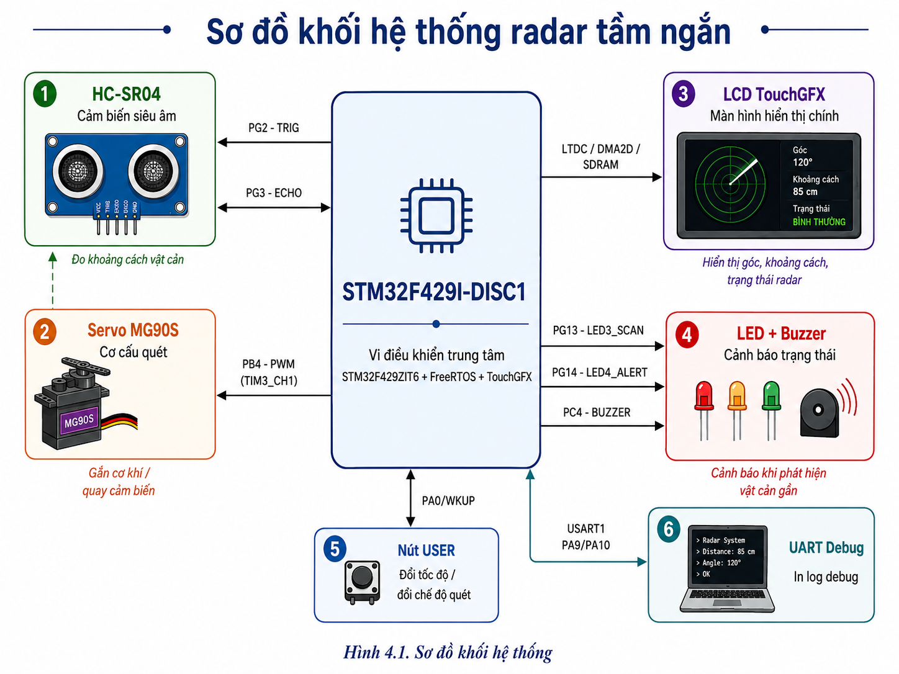
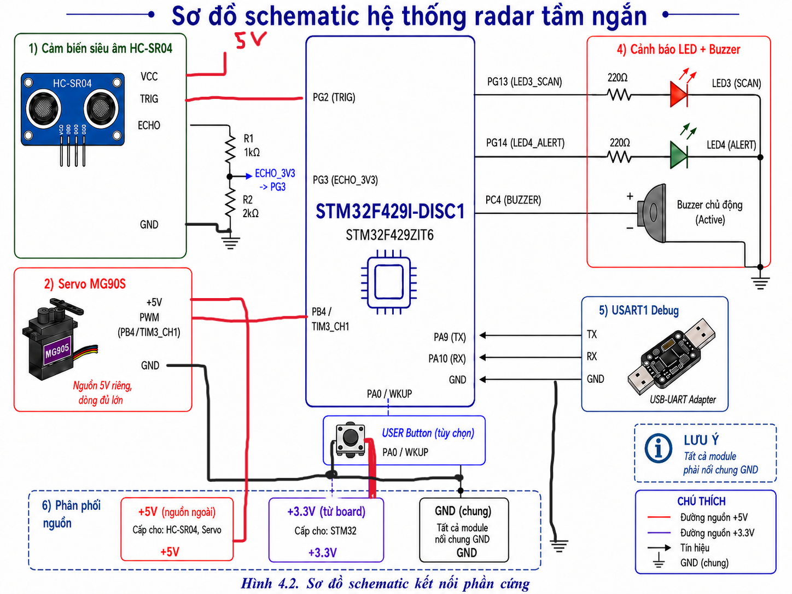
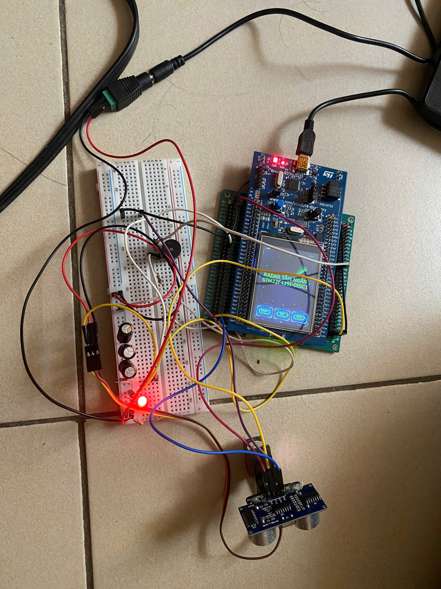
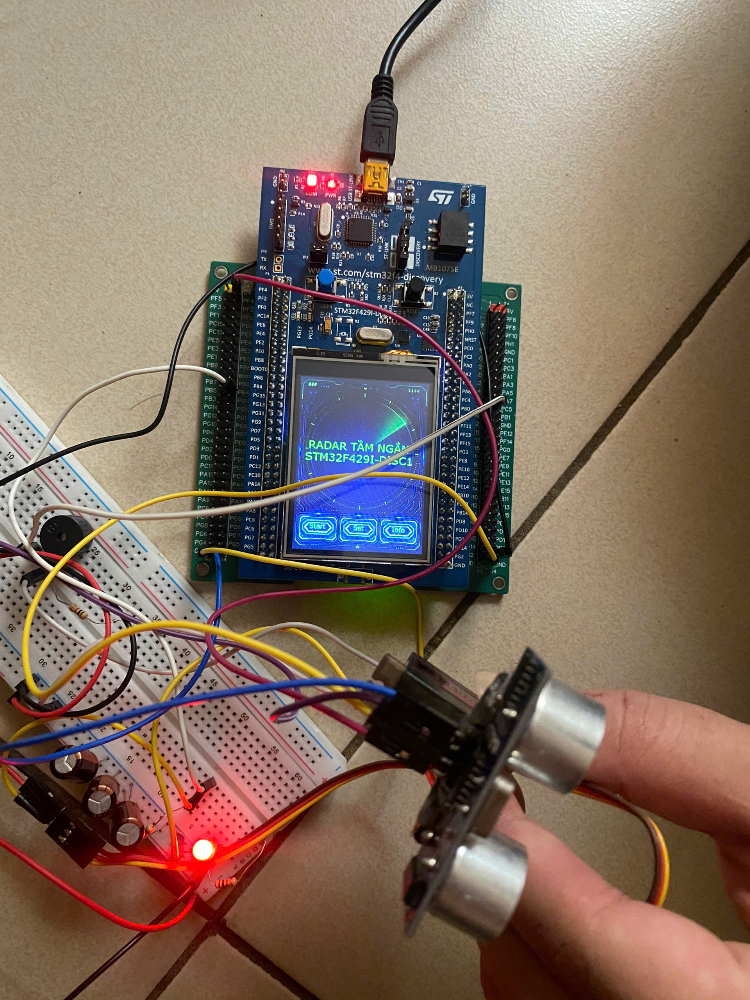
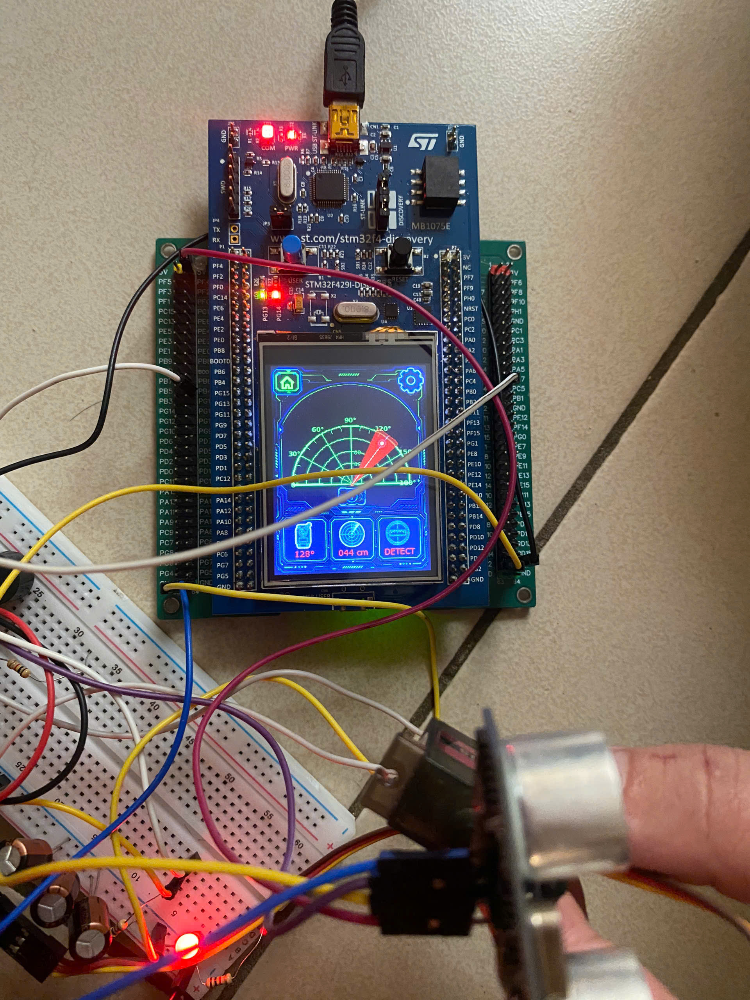
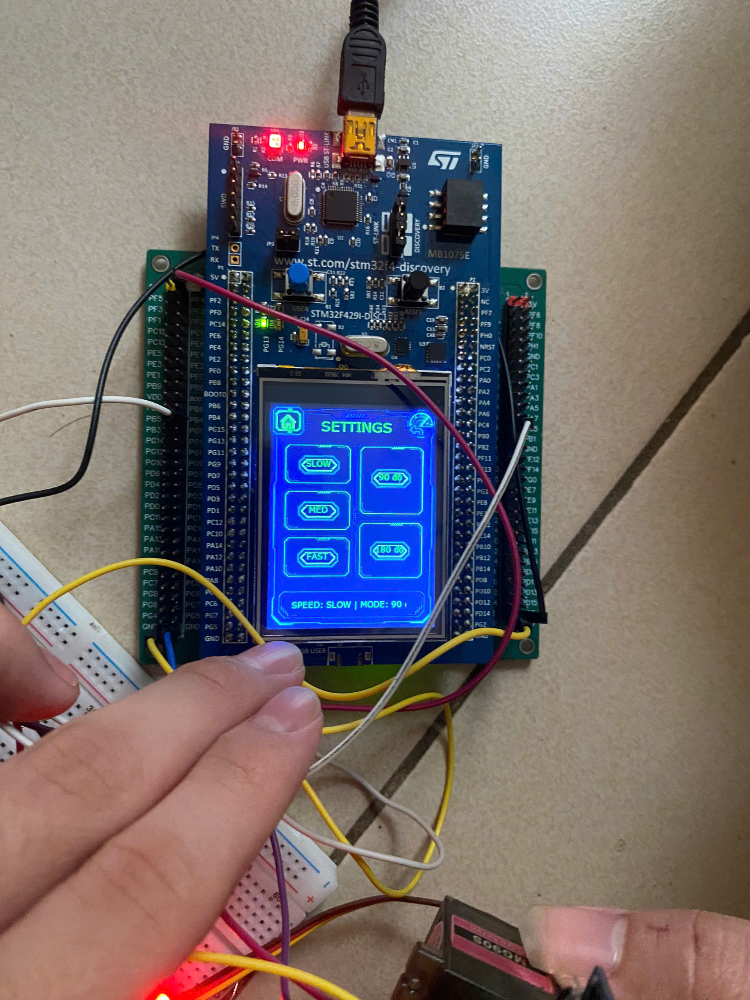
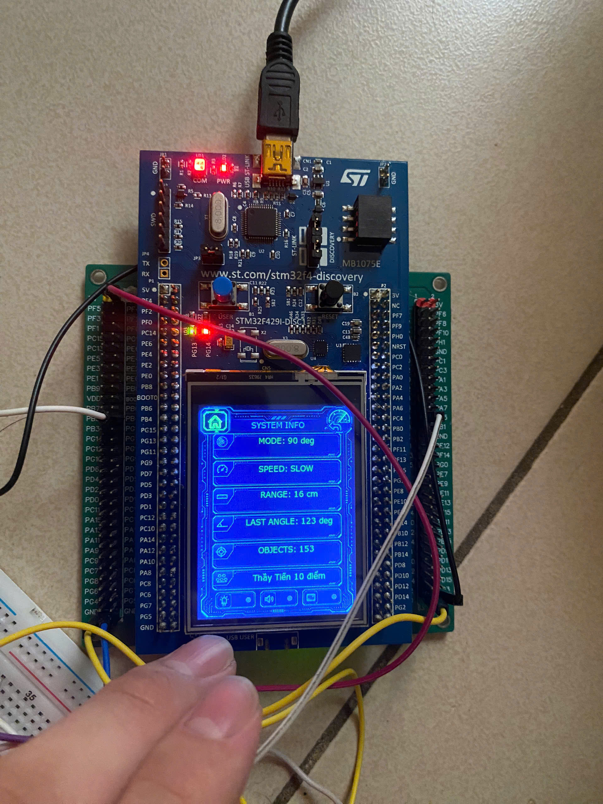

# Radar tầm ngắn - STM32F429I-DISC1 + TouchGFX

> Báo cáo bài tập lớn môn Hệ nhúng: xây dựng mô hình radar tầm ngắn sử dụng STM32F429I-DISC1, cảm biến siêu âm HC-SR04, servo MG90S và giao diện TouchGFX.

## Tóm tắt

Bài tập lớn triển khai một hệ thống quét vật cản tầm ngắn theo mô hình radar. Cảm biến HC-SR04 được gắn trên servo MG90S để thay đổi góc quét. STM32F429I-DISC1 phát tín hiệu trigger, đo độ rộng xung echo, tính khoảng cách, xử lý các ngưỡng phát hiện và cập nhật dữ liệu lên màn hình LCD TouchGFX tích hợp của STM32.

Hệ thống hỗ trợ quét theo góc, đo khoảng cách vật cản, hiển thị góc/khoảng cách/trạng thái, thay đổi chế độ quét, thay đổi tốc độ quét và cảnh báo bằng LED/buzzer khi vật cản nằm trong vùng gần.

## Mục lục

- [1. GIỚI THIỆU](#1-giới-thiệu)
- [2. TÁC GIẢ](#2-tác-giả)
- [3. MÔI TRƯỜNG HOẠT ĐỘNG](#3-môi-trường-hoạt-động)
- [4. SƠ ĐỒ SCHEMATIC / KẾT NỐI PHẦN CỨNG](#4-sơ-đồ-schematic--kết-nối-phần-cứng)
- [5. NGUYÊN LÝ HOẠT ĐỘNG](#5-nguyên-lý-hoạt-động)
- [6. TÍCH HỢP HỆ THỐNG](#6-tích-hợp-hệ-thống)
- [7. KIẾN TRÚC PHẦN MỀM](#7-kiến-trúc-phần-mềm)
- [8. ĐẶC TẢ HÀM / MODULE QUAN TRỌNG](#8-đặc-tả-hàm--module-quan-trọng)
- [9. KẾT QUẢ](#9-kết-quả)
- [10. ĐÁNH GIÁ THỰC TẾ VÀ GIỚI HẠN](#10-đánh-giá-thực-tế-và-giới-hạn)
- [11. KHÓ KHĂN VÀ KINH NGHIỆM RÚT RA](#11-khó-khăn-và-kinh-nghiệm-rút-ra)
- [12. HƯỚNG PHÁT TRIỂN](#12-hướng-phát-triển)
- [13. TÀI LIỆU THAM KHẢO](#13-tài-liệu-tham-khảo)
- [14. KẾT LUẬN](#14-kết-luận)

---

## 1. GIỚI THIỆU

### 1.1. Tên đề tài

**Radar tầm ngắn**

### 1.2. Mục tiêu

Mục tiêu của đề tài là thiết kế và triển khai một sản phẩm hệ thống nhúng có khả năng:

- Quét khu vực phía trước cảm biến theo một dải góc xác định.
- Đo khoảng cách vật cản bằng cảm biến siêu âm HC-SR04.
- Điều khiển servo MG90S để thay đổi hướng quét.
- Hiển thị trực quan trạng thái radar trên LCD TouchGFX của STM32F429I-DISC1.
- Hiển thị góc quét, khoảng cách, trạng thái và vị trí tương đối của vật cản.
- Cảnh báo bằng LED và buzzer khi phát hiện vật thể trong vùng gần.
- Cho phép thay đổi tốc độ và chế độ quét bằng giao diện cảm ứng hoặc nút USER.
- Hỗ trợ UART debug để theo dõi tín hiệu echo, khoảng cách và trạng thái chương trình.

### 1.3. Ý tưởng hệ thống

Hệ thống không phải radar RF theo nghĩa vật lý mà là một mô hình radar tầm ngắn sử dụng cảm biến siêu âm để mô phỏng quá trình quét và phát hiện vật cản.

Servo MG90S quay cảm biến HC-SR04 qua từng góc. Tại mỗi vị trí, STM32 phát xung trigger, bắt cạnh lên và cạnh xuống của tín hiệu echo, tính khoảng cách rồi gửi dữ liệu cho giao diện TouchGFX.

Luồng xử lý tổng quát:

1. Servo được đặt tới góc quét hiện tại.
2. Hệ thống chờ một khoảng ngắn để cơ cấu servo ổn định.
3. STM32 phát xung trigger 10 us tới HC-SR04.
4. Echo được bắt bằng ngắt ngoài EXTI3 trên chân PG3.
5. Phần mềm tính thời gian echo và suy ra khoảng cách.
6. Logic ứng dụng xác định trạng thái `SCAN`, `DETECT` hoặc `ALERT`.
7. Dữ liệu radar được gửi sang giao diện bằng FreeRTOS message queue.
8. LCD TouchGFX, LED và buzzer được cập nhật theo trạng thái mới.
9. Góc quét được tăng hoặc giảm để tiếp tục chu kỳ quét.

### 1.4. Chức năng chính

| Nhóm chức năng      | Mô tả                                                                        |
| ------------------- | ---------------------------------------------------------------------------- |
| Đo khoảng cách      | Đo khoảng cách bằng HC-SR04, xử lý echo bằng EXTI và DWT cycle counter.      |
| Quét góc            | Điều khiển servo MG90S bằng PWM TIM3_CH1 trên PB4.                           |
| Hiển thị LCD        | Giao diện TouchGFX hiển thị góc, khoảng cách, trạng thái và vị trí mục tiêu. |
| Chế độ quét         | Hỗ trợ chế độ quét 90 độ và 180 độ theo cấu hình trong `radar_config.h`.     |
| Tốc độ quét         | Hỗ trợ các mức `SLOW`, `MED`, `FAST`.                                        |
| Cảnh báo            | LED/buzzer phản hồi theo trạng thái phát hiện vật cản và vật cản gần.        |
| Nút USER            | Bấm ngắn đổi tốc độ; giữ lâu đổi chế độ quét                                 |
| FreeRTOS queue      | Truyền dữ liệu radar và cấu hình điều khiển giữa các task                    |
| Điều khiển nút USER | Bấm ngắn đổi tốc độ; giữ lâu đổi chế độ quét.                                |
| Debug UART          | In trạng thái đo, echo, counter và dữ liệu UI qua USART1.                    |

### 1.5. Cấu trúc project chính

```text
IT4210-HE-NHUNG/
|-- README.md
|-- REPORT_PLAN.md
|-- docs/
|   `-- images/
`-- radar_short_range_touchgfx/
    |-- Core/
    |-- Drivers/
    |-- Middlewares/
    |-- STM32CubeIDE/
    |-- TouchGFX/
    |-- DesignAssets/
    `-- STM32F429I_DISCO_REV_D01.ioc
```

---

## 2. TÁC GIẢ

### 2.1. Thành viên nhóm

| STT | MSSV     | Họ và tên         | Email                          |
| --: | -------- | ----------------- | ------------------------------ |
|   1 | 20235318 | Nguyễn Minh Giang | giang.nm235318@sis.hust.edu.vn |
|   2 | 20235333 | Bùi Trung Hoàng   | hoang.bt235333@sis.hust.edu.vn |
|   3 | 20235342 | Phạm Ngọc Hưng    | hung.pn235342@sis.hust.edu.vn  |
|   4 | 20235421 | Khương Anh Tài    | tai.ka235421@sis.hust.edu.vn   |

### 2.2. Phân công công việc

| Thành viên         | Công việc chính                                                                                             | Ghi chú      |
| ------------------ | ----------------------------------------------------------------------------------------------------------- | ------------ |
| Nguyễn Minh Giang  | Board điều khiển STM32                                                                                      | STM32        |
| Bùi Trung Hoàng    | Điều khiển Servo                                                                                            | Servo        |
| Phạm Ngọc Hưng     | Thiết kế giao diện TouchGFX                                                                                 | STM32        |
| Khương Anh Tài     | Điều khiển HC-SR04                                                                                          | HC_SR04      |

## 3. MÔI TRƯỜNG HOẠT ĐỘNG

### 3.1. Board STM32F429I-DISC1

Hệ thống sử dụng board **STM32F429I-DISC1** làm bộ điều khiển trung tâm. Vi điều khiển chính là **STM32F429ZIT6**, thuộc dòng STM32F4, phù hợp với bài toán vừa điều khiển ngoại vi thời gian thực vừa chạy giao diện đồ họa nhúng.

Trong project, board đảm nhiệm các vai trò:

- Khởi tạo và điều phối GPIO, EXTI, timer, UART, LTDC, DMA2D và FMC/SDRAM.
- Chạy **FreeRTOS CMSIS v2** để tách xử lý radar, giao diện và nút USER.
- Chạy **TouchGFX** trên LCD tích hợp của board.
- Điều khiển servo MG90S bằng PWM.
- Đọc cảm biến HC-SR04 bằng ngắt ngoài.
- Điều khiển LED và buzzer.
- Truyền log debug về máy tính qua USART1.

Board STM32F429I-DISC1 có LCD và SDRAM tích hợp. Đây là lợi thế lớn khi triển khai TouchGFX, nhưng cũng làm nhiều chân của MCU đã được sử dụng bởi LCD và bộ nhớ ngoài.

Vì vậy pin mapping phải bám sát:

- [`STM32F429I_DISCO_REV_D01.ioc`](./radar_short_range_touchgfx/STM32F429I_DISCO_REV_D01.ioc)
- [`Core/Inc/main.h`](./radar_short_range_touchgfx/Core/Inc/main.h)

### 3.2. Các module sử dụng

| Nhóm                 | Module                             | Vai trò                                                 |
| -------------------- | ---------------------------------- | ------------------------------------------------------- |
| Điều khiển trung tâm | STM32F429I-DISC1 / STM32F429ZIT6   | Chạy firmware, FreeRTOS, TouchGFX và điều phối ngoại vi |
| Đo khoảng cách       | HC-SR04                            | Đo khoảng cách vật cản bằng sóng siêu âm                |
| Cơ cấu quét          | Servo MG90S                        | Quay cảm biến theo góc quét                             |
| Hiển thị             | LCD tích hợp trên STM32F429I-DISC1 | Hiển thị giao diện radar bằng TouchGFX                  |
| Cảnh báo             | Buzzer active                      | Cảnh báo âm thanh khi vật thể ở vùng gần                |
| Chỉ thị trạng thái   | LED on-board PG13/PG14             | Báo trạng thái quét và cảnh báo                         |
| Điều khiển nhanh     | Nút USER PA0/WKUP                  | Bấm ngắn đổi tốc độ, giữ lâu đổi chế độ                 |
| Debug                | USART1 PA9/PA10                    | In log đo khoảng cách, echo và trạng thái hệ thống      |

### 3.3. Bill of Materials

| STT | Linh kiện                       | Số lượng | Vai trò                     | Ghi chú kỹ thuật                          |
| --: | ------------------------------- | -------: | --------------------------- | ----------------------------------------- |
|   1 | STM32F429I-DISC1                |        1 | Board điều khiển trung tâm  | Có LCD, SDRAM và ST-LINK                  |
|   2 | HC-SR04                         |        1 | Cảm biến đo khoảng cách     | Trigger 10 us, sóng siêu âm khoảng 40 kHz |
|   3 | Servo MG90S                     |        1 | Quay cảm biến theo góc      | Điều khiển PWM trên TIM3_CH1/PB4          |
|   4 | Buzzer active                   |        1 | Cảnh báo âm thanh           | Điều khiển GPIO PC4                       |
|   5 | LED on-board                    |        2 | Báo scan và alert           | PG13 và PG14                              |
|   6 | LCD tích hợp                    |        1 | Hiển thị giao diện TouchGFX | LCD có sẵn trên board                     |
|   7 | Nút USER                        |        1 | Điều khiển nhanh            | PA0/WKUP                                  |
|   8 | Mạch chia áp hoặc level shifter |        1 | Hạ mức tín hiệu echo        | Bảo vệ GPIO 3.3 V                         |
|   9 | Dây jumper và breadboard        |     1 bộ | Đấu nối phần cứng           | Cần bảo đảm tiếp xúc chắc chắn            |
|  10 | Nguồn 5 V đủ dòng               |        1 | Cấp nguồn servo và cảm biến | Nên có tụ lọc gần servo                   |

### 3.4. Phần mềm và công cụ

| Hạng mục             | Thông tin                      |
| -------------------- | ------------------------------ |
| Project chính        | `radar_short_range_touchgfx`   |
| File cấu hình CubeMX | `STM32F429I_DISCO_REV_D01.ioc` |
| MCU                  | STM32F429ZITx                  |
| STM32CubeMX          | 6.17.0                         |
| STM32Cube FW_F4      | V1.28.3                        |
| TouchGFX             | X-CUBE-TOUCHGFX 4.26.1         |
| RTOS                 | FreeRTOS CMSIS v2              |
| Toolchain            | STM32CubeIDE                   |
| Giao diện            | TouchGFX, LTDC, DMA2D, SDRAM   |

### 3.5. Cấu hình ngoại vi chính

| Ngoại vi   | Cấu hình / vai trò                                                 |
| ---------- | ------------------------------------------------------------------ |
| TIM3 CH1   | PWM servo trên PB4, Prescaler = 89, Period = 19999, Pulse = 1500   |
| EXTI3      | Bắt tín hiệu echo trên PG3 ở cả cạnh lên và cạnh xuống             |
| DWT CYCCNT | Tạo delay micro giây và đo độ rộng echo                            |
| TIM2       | Có cấu hình input capture nhưng không phải đường đo chính hiện tại |
| USART1     | TX PA9, RX PA10, dùng cho debug UART                               |
| LTDC       | Điều khiển LCD tích hợp, kích thước giao diện 240 x 320            |
| DMA2D      | Tăng tốc xử lý đồ họa                                              |
| FMC/SDRAM  | Bộ nhớ ngoài phục vụ TouchGFX                                      |
| FreeRTOS   | Chạy GUI task, radar task, button task và message queue            |

---

## 4. SƠ ĐỒ SCHEMATIC / KẾT NỐI PHẦN CỨNG

### 4.1. Sơ đồ khối hệ thống

<p align="center">
  
  <br>
  <em>Hình 1. Sơ đồ khối hệ thống radar tầm ngắn.</em>
</p>

STM32F429I-DISC1 là bộ xử lý trung tâm của hệ thống:

- HC-SR04 nhận trigger và gửi echo về STM32.
- Servo MG90S nhận PWM để thay đổi hướng quét.
- LCD TouchGFX hiển thị dữ liệu radar.
- LED và buzzer phản hồi trạng thái cảnh báo.
- Nút USER thay đổi tốc độ và chế độ quét.
- USART1 gửi dữ liệu debug về máy tính.

### 4.2. Sơ đồ schematic

<p align="center">
  
  <br>
  <em>Hình 2. Sơ đồ schematic kết nối phần cứng.</em>
</p>

Sơ đồ schematic cần thể hiện:

- Nguồn 5 V cấp cho HC-SR04 và servo MG90S.
- Nguồn cấp cho STM32F429I-DISC1.
- GND chung giữa STM32, cảm biến, servo và buzzer.
- PG2 nối với chân TRIG của HC-SR04.
- PG3 nhận tín hiệu ECHO qua mạch chia áp hoặc level shifter.
- PB4/TIM3_CH1 xuất PWM điều khiển servo.
- PC4 điều khiển buzzer.
- PG13 và PG14 điều khiển LED trạng thái.
- PA9 và PA10 dùng cho USART1 debug.

### 4.3. Ảnh đấu nối thực tế

<p align="center">
  
  <br>
  <em>Hình 3. Ảnh đấu nối thực tế hệ thống radar tầm ngắn.</em>
</p>

Ảnh đấu nối nên chụp đủ:

- Board STM32F429I-DISC1.
- HC-SR04 được gắn trên servo MG90S.
- Nguồn 5 V cho servo.
- Dây trigger và echo.
- Mạch chia áp echo.
- Buzzer.
- Dây GND chung.

### 4.4. Bảng pin mapping

| Chân STM32 | Tên tín hiệu             | Module        | Chiều          | Giải thích                             |
| ---------- | ------------------------ | ------------- | -------------- | -------------------------------------- |
| PB4        | `SERVO_PWM` / `TIM3_CH1` | Servo MG90S   | STM32 → Servo  | Xuất PWM 50 Hz để điều khiển góc servo |
| PG2        | `HCSR04_TRIG`            | HC-SR04       | STM32 → Sensor | Phát xung trigger 10 us                |
| PG3        | `HCSR04_ECHO` / `EXTI3`  | HC-SR04       | Sensor → STM32 | Bắt cạnh lên và cạnh xuống của echo    |
| PC4        | `BUZZER`                 | Buzzer active | STM32 → Buzzer | Cảnh báo khi vật nằm trong vùng gần    |
| PG13       | `LED3_SCAN`              | LED3 on-board | STM32 → LED    | Báo hệ thống đang quét                 |
| PG14       | `LED4_ALERT`             | LED4 on-board | STM32 → LED    | Báo phát hiện hoặc cảnh báo gần        |
| PA0/WKUP   | `B1_USER`                | Nút USER      | Button → STM32 | Bấm ngắn đổi tốc độ, giữ lâu đổi mode  |
| PA9        | `USART1_TX`              | UART debug    | STM32 → PC     | Gửi log debug                          |
| PA10       | `USART1_RX`              | UART debug    | PC → STM32     | Nhận dữ liệu UART nếu cần mở rộng      |

### 4.5. Video demo phần cứng và vận hành hệ thống

Video dưới đây minh họa quá trình lắp ráp và vận hành thực tế của hệ thống radar tầm ngắn. Nội dung demo gồm:

- Board STM32F429I-DISC1 và các kết nối phần cứng.
- Servo MG90S quay cảm biến HC-SR04.
- HC-SR04 đo khoảng cách vật cản.
- Giao diện TouchGFX hiển thị góc, khoảng cách và trạng thái radar.
- LED và buzzer phản hồi khi phát hiện vật cản gần.
- Thay đổi tốc độ quét và chế độ quét 90°/180°.

<p align="center">
  <a href="https://youtu.be/2YoLw9p7_Yg?si=Z4sIfAEgFp2_QDHf">
    
  </a>
  <br>
  <em>Video 1. Demo phần cứng và vận hành hệ thống radar tầm ngắn.</em>
</p>

<p align="center">
  <a href="https://youtu.be/2YoLw9p7_Yg?si=Z4sIfAEgFp2_QDHf"><strong>▶ Xem video demo trên YouTube</strong></a>
</p>

---

## 5. NGUYÊN LÝ HOẠT ĐỘNG

### 5.1. Luồng hoạt động tổng quát

Vòng xử lý chính nằm trong hàm `RadarApp_TaskLoop()` của module:

[`radar_app.c`](./radar_short_range_touchgfx/STM32CubeIDE/Application/User/radar_app.c)

Trình tự xử lý:

1. Nhận cấu hình điều khiển mới từ `RadarControlQueue`.
2. Kiểm tra radar đang bật hay tắt.
3. Nếu radar tắt:
   - Đưa hệ thống về trạng thái an toàn.
   - Tắt buzzer và LED cảnh báo.
   - Tạo dữ liệu trạng thái dừng cho UI.
4. Nếu radar bật:
   - Đặt servo tới góc hiện tại.
   - Chờ servo ổn định.
   - Phát trigger HC-SR04.
   - Chờ echo hoặc timeout.
   - Tính khoảng cách.
   - Xác định `SCAN`, `DETECT` hoặc `ALERT`.
   - Điều khiển LED/buzzer.
   - Gửi dữ liệu sang `RadarMessageQueue`.
   - Tăng hoặc giảm góc quét.

### 5.2. Nguyên lý đo HC-SR04

Khi chân TRIG nhận xung mức cao tối thiểu khoảng 10 us, HC-SR04 phát một chùm sóng siêu âm khoảng 40 kHz.

Khi nhận được sóng phản xạ, module tạo xung ECHO. Độ rộng xung ECHO biểu diễn thời gian sóng âm đi từ cảm biến tới vật rồi quay trở lại.

Trong project:

- `PG2 = HCSR04_TRIG`
- `PG3 = HCSR04_ECHO`
- `HCSR04_StartMeasure()` phát trigger.
- `HCSR04_GPIO_EXTI_Callback()` bắt cạnh echo.
- DWT cycle counter đo thời gian echo.

Cạnh lên:

```text
Lưu thời điểm bắt đầu echo
```

Cạnh xuống:

```text
Lưu thời điểm kết thúc echo
Tính echo_us
```

Công thức trong driver:

```c
g_echo_us = (g_falling_cycle - g_rising_cycle) / g_cycles_per_us;
```

### 5.3. Công thức tính khoảng cách

Sóng âm phải đi từ cảm biến tới vật và quay về, do đó quãng đường đo được bằng hai lần khoảng cách thực.

```text
distance = speed_of_sound × echo_time / 2
```

Với vận tốc âm thanh xấp xỉ 343 m/s:

```text
343 m/s = 0.0343 cm/us
```

Suy ra:

```text
distance_cm = echo_us × 0.0343 / 2
            ≈ echo_us / 58
```

Trong code:

```c
distance = g_echo_us / 58U;
```

Các ngưỡng đang sử dụng:

| Tham số                  | Giá trị |
| ------------------------ | ------: |
| `RADAR_MIN_DISTANCE_CM`  |    2 cm |
| `RADAR_MAX_DISPLAY_CM`   |   50 cm |
| `RADAR_OBJECT_DETECT_CM` |   50 cm |
| `RADAR_NEAR_WARNING_CM`  |    5 cm |
| `HCSR04_TIMEOUT_MS`      |   25 ms |

### 5.4. State của driver HC-SR04

Driver sử dụng các trạng thái nội bộ:

| State          | Ý nghĩa                                     |
| -------------- | ------------------------------------------- |
| `IDLE`         | Chưa có phép đo                             |
| `WAIT_RISING`  | Đang chờ cạnh lên của echo                  |
| `WAIT_FALLING` | Đã nhận cạnh lên, đang chờ cạnh xuống       |
| `DONE`         | Đo hoàn thành                               |
| `TIMEOUT`      | Không nhận đủ echo trong thời gian quy định |
| `ERROR`        | Kết quả không hợp lệ                        |

State machine giúp tránh chờ vô hạn và cho phép UART debug xác định lỗi xảy ra ở giai đoạn nào.

### 5.5. Ảnh hưởng của môi trường

Công thức `echo_us / 58` là công thức gần đúng. Kết quả thực tế bị ảnh hưởng bởi:

- Nhiệt độ và độ ẩm.
- Luồng gió.
- Góc đặt vật.
- Bề mặt phản xạ.
- Kích thước vật.
- Rung cơ khí từ servo.
- Nguồn cấp cảm biến.
- Khoảng cách quá gần.
- Echo chéo từ các bề mặt xung quanh.

HC-SR04 phù hợp cho mô hình phát hiện vật cản và đo khoảng cách tương đối, không nên coi là thiết bị đo chính xác cao trong mọi điều kiện.

### 5.6. Điều khiển servo bằng PWM

Servo MG90S được điều khiển bằng PWM chu kỳ khoảng 20 ms, tương ứng 50 Hz.

Driver chính:

- [`servo_mg90s.c`](./radar_short_range_touchgfx/STM32CubeIDE/Application/User/servo_mg90s.c)
- [`servo_mg90s.h`](./radar_short_range_touchgfx/STM32CubeIDE/Application/User/servo_mg90s.h)

Các hàm chính:

| Tham số                  | Giá trị | Ý nghĩa               |
| ------------------------ | ------: | --------------------- |
| `SERVO_MIN_ANGLE_DEG`    |       0 | Góc nhỏ nhất          |
| `SERVO_CENTER_ANGLE_DEG` |      90 | Góc giữa              |
| `SERVO_MAX_ANGLE_DEG`    |     180 | Góc lớn nhất          |
| `SERVO_MIN_PULSE_US`     |  550 us | Pulse ứng với góc nhỏ |
| `SERVO_CENTER_PULSE_US`  | 1500 us | Pulse trung tâm       |
| `SERVO_MAX_PULSE_US`     | 2450 us | Pulse ứng với góc lớn |

- `Servo_Init()`
- `Servo_SetPulseUs()`
- `Servo_SetAngle()`
- `Servo_Stop()`
- `Servo_GetLastAngle()`
- `Servo_GetLastPulseUs()`

Thông số cấu hình:

| Tham số        | Giá trị |
| -------------- | ------: |
| Góc nhỏ nhất   |      0° |
| Góc giữa       |     90° |
| Góc lớn nhất   |    180° |
| Pulse nhỏ nhất |  550 us |
| Pulse giữa     | 1500 us |
| Pulse lớn nhất | 2450 us |

Công thức nội suy:

```text
pulse_us = SERVO_MIN_PULSE_US
         + angle_deg × (SERVO_MAX_PULSE_US - SERVO_MIN_PULSE_US) / 180
```

### 5.7. Cấu hình TIM3

TIM3_CH1 được đưa ra PB4.

| Cấu hình      | Giá trị |
| ------------- | ------: |
| Timer clock   |  90 MHz |
| Prescaler     |      89 |
| Period        |   19999 |
| Pulse ban đầu |    1500 |

Mỗi tick timer:

```text
tick = (89 + 1) / 90 MHz
     = 1 us
```

Chu kỳ PWM:

```text
period = (19999 + 1) × 1 us
       = 20000 us
       = 20 ms
```

Tần số:

```text
f = 1 / 20 ms
  = 50 Hz
```

Việc cấu hình tick 1 us giúp phần mềm có thể ghi trực tiếp giá trị pulse theo micro giây vào thanh ghi compare.

### 5.8. Hiển thị dữ liệu trên TouchGFX

Giao diện chính sử dụng LCD tích hợp của STM32F429I-DISC1.

Dữ liệu radar không được ghi trực tiếp từ driver cảm biến vào widget TouchGFX. Module `radar_ui_bridge.c/h` làm cầu nối giữa:

```text
RadarTask viết bằng C
          ↕
RadarUiBridge + FreeRTOS queue
          ↕
TouchGFX View viết bằng C++
```

Dữ liệu lõi gồm:

- `angle_deg`
- `distance_cm`
- `distance_valid`
- `object_detected`
- `near_warning`
- `radar_status`
- `object_count`
- `last_object_distance_cm`
- `last_object_angle_deg`
- `buzzer_on`
- `led3_on`
- `led4_on`

Cấu hình điều khiển gồm:

- `radar_enabled`
- `scan_mode_deg`
- `speed_mode`

Trong `ScreenScanView.cpp`, UI cập nhật:

- Góc quét.
- Khoảng cách.
- Trạng thái.
- Tia quét xanh hoặc đỏ.
- Vị trí target dot.
- Trạng thái phát hiện vật cản.

```text
[Chèn ảnh: giao diện màn hình radar]
```

### 5.9. Vai trò buzzer và LED

Module:

- [`buzzer_led.c`](./radar_short_range_touchgfx/STM32CubeIDE/Application/User/buzzer_led.c)
- [`buzzer_led.h`](./radar_short_range_touchgfx/STM32CubeIDE/Application/User/buzzer_led.h)

Pin:

```text
PC4  = BUZZER
PG13 = LED3_SCAN
PG14 = LED4_ALERT
```

Logic:

| Trạng thái                  | LED scan  | LED alert | Buzzer          |
| --------------------------- | --------- | --------- | --------------- |
| Không có vật                | Hoạt động | Tắt       | Tắt             |
| Có vật trong vùng phát hiện | Hoạt động | Bật       | Tắt             |
| Vật ở vùng rất gần          | Hoạt động | Bật       | Kêu theo chu kỳ |

---

## 6. TÍCH HỢP HỆ THỐNG

### 6.1. Kiến trúc tổng quát

Project được chia thành các lớp:

| Lớp               | File / module                                                | Vai trò                                                           |
| ----------------- | ------------------------------------------------------------ | ----------------------------------------------------------------- |
| Nền tảng          | `main.c`, `.ioc`                                             | Khởi tạo clock, GPIO, timer, UART, LTDC, DMA2D, SDRAM và FreeRTOS |
| Driver            | `hcsr04.c`, `servo_mg90s.c`, `buzzer_led.c`, `radar_debug.c` | Điều khiển phần cứng                                              |
| Cấu hình          | `radar_config.h`, `radar_types.h`                            | Chứa ngưỡng, mode và kiểu dữ liệu                                 |
| Ứng dụng          | `radar_app.c`                                                | Điều phối toàn bộ hoạt động radar                                 |
| Giao tiếp task/UI | `radar_ui_bridge.c`                                          | Message queue và snapshot dữ liệu                                 |
| Giao diện         | Các file `Screen...View.cpp`                                 | Hiển thị dữ liệu và nhận thao tác                                 |
| Middleware        | FreeRTOS, TouchGFX, HAL                                      | Lập lịch, queue, đồ họa và abstraction phần cứng                  |

### 6.2. Các task chính

| Task          | Hàm                  | Vai trò                                |
| ------------- | -------------------- | -------------------------------------- |
| `defaultTask` | `StartDefaultTask()` | Đọc nút USER                           |
| `GUI_Task`    | `TouchGFX_Task()`    | Chạy giao diện TouchGFX                |
| `radarTask`   | `StartRadarTask()`   | Khởi tạo và chạy `RadarApp_TaskLoop()` |

### 6.3. Luồng dữ liệu cảm biến

```text
HC-SR04
  -> EXTI3 callback
  -> hcsr04.c
  -> RadarApp_MeasureDistance()
  -> RadarApp_TaskLoop()
  -> RadarCoreData_t
  -> RadarMessageQueue
  -> RadarUiBridge_GetData()
  -> TouchGFX
  -> LCD
```

Luồng cảnh báo:

```text
RadarApp_TaskLoop()
  -> detected / near_warning
  -> Alert_Update()
  -> PG13 / PG14 / PC4
```

### 6.4. FreeRTOS message queue

Project sử dụng hai queue.

#### RadarMessageQueue

Truyền dữ liệu từ radar task sang UI:

```text
RadarTask
  -> RadarUiBridge_SetData()
  -> RadarMessageHandle
  -> RadarUiBridge_GetData()
  -> TouchGFX
```

Kiểu dữ liệu chính:

```c
RadarCoreData_t
```

Queue này chứa dữ liệu đo và trạng thái hệ thống.

#### RadarControlQueue

Truyền lệnh điều khiển từ UI hoặc button task sang radar task:

```text
TouchGFX / ButtonTask
  -> RadarUiBridge_SetRadarEnabled()
  -> RadarUiBridge_SetSpeedMode()
  -> RadarUiBridge_SetScanMode()
  -> RadarControlQueueHandle
  -> RadarApp_TaskLoop()
```

Kiểu dữ liệu chính:

```c
RadarControlConfig_t
```

## 7. KIẾN TRÚC PHẦN MỀM

| File / module            | Vai trò                                                       |
| ------------------------ | ------------------------------------------------------------- |
| `Core/Src/main.c`        | Khởi tạo HAL, ngoại vi, FreeRTOS task, queue và EXTI callback |
| `radar_config.h`         | Chứa thông số khoảng cách, servo, mode, speed và UI           |
| `radar_types.h`          | Khai báo enum và struct dữ liệu radar                         |
| `radar_app.c/h`          | Điều phối quét, đo, cảnh báo và truyền dữ liệu                |
| `hcsr04.c/h`             | Driver HC-SR04 dùng EXTI + DWT                                |
| `servo_mg90s.c/h`        | Driver servo dùng TIM3_CH1                                    |
| `buzzer_led.c/h`         | Driver LED và buzzer                                          |
| `radar_ui_bridge.c/h`    | Queue và snapshot giữa radar task với TouchGFX                |
| `radar_debug.c/h`        | In log qua USART1                                             |
| `ScreenHomeView.cpp`     | Màn hình Home                                                 |
| `ScreenScanView.cpp`     | Màn hình radar chính                                          |
| `ScreenSettingsView.cpp` | Chọn speed và mode                                            |
| `ScreenInfoView.cpp`     | Hiển thị thống kê                                             |

---

## 8. ĐẶC TẢ HÀM / MODULE QUAN TRỌNG

### 8.1. Driver HC-SR04

File:

- [`hcsr04.h`](./radar_short_range_touchgfx/STM32CubeIDE/Application/User/hcsr04.h)
- [`hcsr04.c`](./radar_short_range_touchgfx/STM32CubeIDE/Application/User/hcsr04.c)

Driver HC-SR04 sử dụng state machine, tự định nghĩa các biến trạng thái để xử lý logic một cách tường minh và rành mạch

```C
/**
 * @brief Các trạng thái hoạt động của driver HC-SR04.
 *
 * Enum HCSR04_State_t
 *
 * - IDLE         : Chưa thực hiện phép đo.
 * - WAIT_RISING  : Đã phát Trigger, đang chờ cạnh lên của Echo.
 * - WAIT_FALLING : Đã nhận cạnh lên, đang chờ cạnh xuống để kết thúc phép đo.
 * - DONE         : Đã đo xong và có dữ liệu khoảng cách hợp lệ.
 * - TIMEOUT      : Không nhận được Echo trong thời gian quy định.
 * - ERROR        : Xuất hiện lỗi trong quá trình đo.
 */
```

```C
/**
 * @brief Khởi tạo driver HC-SR04.
 *
 * Hàm bật bộ đếm chu kỳ DWT để đo thời gian có độ phân giải micro giây,
 * khởi tạo các biến trạng thái nội bộ của driver và đưa chân TRIG về mức thấp.
 * Đây là bước chuẩn bị trước khi radar bắt đầu thực hiện các phép đo khoảng cách.
 *
 * @param None.
 * @return None.
 */
void HCSR04_Init(void);
```

```C
/**
 * @brief Bắt đầu một lần đo khoảng cách bằng HC-SR04.
 *
 * Hàm phát xung Trigger có độ rộng khoảng 10 us trên chân TRIG và chuyển
 * trạng thái driver sang chờ tín hiệu Echo. Hàm chỉ khởi động quá trình đo,
 * không chờ kết quả hoàn thành.
 *
 * @param None.
 * @return None.
 */
void HCSR04_StartMeasure(void);
```

```C
/**
 * @brief Xử lý ngắt tín hiệu Echo của HC-SR04.
 *
 * Khi phát hiện cạnh lên của chân Echo, hàm lưu thời điểm bắt đầu.
 * Khi phát hiện cạnh xuống, hàm lưu thời điểm kết thúc, tính độ rộng xung
 * Echo theo micro giây và cập nhật trạng thái hoàn thành phép đo.
 *
 * @param GPIO_Pin: Chân GPIO phát sinh ngắt.
 * @return None.
 */
void HCSR04_GPIO_EXTI_Callback(uint16_t GPIO_Pin);
```

```C
/**
 * @brief Kiểm tra timeout của quá trình đo.
 *
 * Hàm kiểm tra xem thời gian chờ Echo có vượt quá ngưỡng cho phép hay không.
 * Nếu quá thời gian, trạng thái driver được chuyển sang TIMEOUT nhằm tránh
 * chương trình bị chờ vô hạn khi cảm biến không nhận được Echo.
 *
 * @param None.
 * @return None.
 */
void HCSR04_ProcessTimeout(void);
```

```C
/**
 * @brief Lấy khoảng cách đo được theo đơn vị centimet.
 *
 * Hàm chuyển đổi độ rộng xung Echo sang khoảng cách bằng công thức:
 *
 *      distance = echo_us / 58
 *
 * Sau khi chuyển đổi, hàm kiểm tra tính hợp lệ của kết quả (timeout,
 * khoảng cách tối thiểu, dữ liệu lỗi...) trước khi trả về.
 *
 * @param[out] distance_cm Con trỏ lưu khoảng cách đo được (cm).
 * @return
 *      - 1: Giá trị hợp lệ.
 *      - 0: Giá trị không hợp lệ hoặc phép đo thất bại.
 */
uint8_t HCSR04_GetDistanceCm(uint16_t *distance_cm);
```

```C
/**
 * @brief Lấy độ rộng xung Echo gần nhất.
 *
 * Hàm trả về giá trị Echo đã đo được gần nhất theo đơn vị micro giây,
 * phục vụ việc ghi log hoặc đánh giá chất lượng tín hiệu cảm biến.
 *
 * @param None.
 * @return Độ rộng xung Echo (us).
 */
uint32_t HCSR04_GetLastEchoUs(void);
```

### 8.2. Driver servo MG90S

File:

- [`servo_mg90s.h`](./radar_short_range_touchgfx/STM32CubeIDE/Application/User/servo_mg90s.h)
- [`servo_mg90s.c`](./radar_short_range_touchgfx/STM32CubeIDE/Application/User/servo_mg90s.c)

Module servo MG90S chịu trách nhiệm tạo tín hiệu PWM để điều khiển góc quay của servo. Các hàm trong module cho phép khởi tạo PWM, điều khiển góc hoặc độ rộng xung trực tiếp, đồng thời lưu lại trạng thái gần nhất phục vụ việc kiểm tra và debug.

```C
/**
 * @brief Khởi tạo driver servo MG90S.
 *
 * Hàm khởi động kênh PWM TIM3 Channel 1 và đưa servo về vị trí
 * trung tâm mặc định. Đây là bước chuẩn bị trước khi radar bắt đầu
 * thực hiện quá trình quét.
 *
 * @param None.
 * @return None.
 */
void Servo_Init(void);
```

```C
/**
 * @brief Đặt độ rộng xung PWM cho servo.
 *
 * Hàm cập nhật độ rộng xung PWM theo đơn vị micro giây
 *
 * @param pulse_us Độ rộng xung PWM (us).
 * @return None.
 */
void Servo_SetPulseUs(uint16_t pulse_us);
```

```C
/**
 * @brief Điều khiển servo theo góc quay.
 *
 * Đặt góc quay của servo đế vị trí mong muốn trong khoảng 0 đến 180 độ
 *
 * @param angle_deg Góc cần đặt (độ).
 * @return None.
 */
void Servo_SetAngle(uint16_t angle_deg);
```

```C
/**
 * @brief Đưa servo về vị trí trung tâm.
 *
 * Hàm điều khiển servo quay về góc giữa (90 độ), tạo trạng thái
 * an toàn khi hệ thống dừng hoạt động hoặc cần reset vị trí quét.
 *
 * @param None.
 * @return None.
 */
void Servo_Stop(void);
```

```C
/**
 * @brief Lấy góc quay gần nhất của servo.
 *
 * Hàm trả về giá trị góc cuối cùng đã được đặt cho servo.
 * Giá trị này hữu ích cho việc theo dõi trạng thái hoặc debug.
 *
 * @param None.
 * @return Góc quay gần nhất (độ).
 */
uint16_t Servo_GetLastAngle(void);
```

```C
/**
 * @brief Lấy độ rộng xung PWM gần nhất.
 *
 * Hàm trả về giá trị độ rộng xung PWM cuối cùng đã được cấu hình
 * cho servo theo đơn vị micro giây.
 *
 * @param None.
 * @return Độ rộng xung PWM gần nhất (us).
 */
uint16_t Servo_GetLastPulseUs(void);
```

Các tham số cấu hình quan trọng của servo được định nghĩa trong [`radar_config.h`](./radar_short_range_touchgfx/STM32CubeIDE/Application/User/radar_config.h).

| Tham số                 | Giá trị mặc định | Ý nghĩa                                                                      |
| ----------------------- | ---------------: | ---------------------------------------------------------------------------- |
| `SERVO_MIN_PULSE_US`    |            `550` | Độ rộng xung PWM nhỏ nhất, tương ứng với góc quay nhỏ nhất của servo. (0°)   |
| `SERVO_CENTER_PULSE_US` |           `1500` | Độ rộng xung PWM tại vị trí trung tâm (90°).                                 |
| `SERVO_MAX_PULSE_US`    |           `2450` | Độ rộng xung PWM lớn nhất, tương ứng với góc quay lớn nhất của servo. (180°) |

### 8.3. Driver buzzer và LED

File:

- [`buzzer_led.h`](./radar_short_range_touchgfx/STM32CubeIDE/Application/User/buzzer_led.h)
- [`buzzer_led.c`](./radar_short_range_touchgfx/STM32CubeIDE/Application/User/buzzer_led.c)

Module buzzer và LED chịu trách nhiệm điều khiển các thiết bị cảnh báo của hệ thống. Nhóm hàm này cung cấp giao diện hàm bật/tắt từng thiết bị LED và buzzer.

```C
/**
 * @brief Khởi tạo driver buzzer và LED.
 *
 * @param None.
 * @return None.
 */
void BuzzerLed_Init(void);
```

```C
/**
 * @brief Điều khiển trạng thái buzzer.
 *
 * Hàm bật hoặc tắt buzzer active theo trạng thái đầu vào.
 *
 * @param on Trạng thái buzzer (1: bật, 0: tắt).
 * @return None.
 */
void Buzzer_Set(uint8_t on);
```

```C
/**
 * @brief Điều khiển LED Scan.
 *
 * Hàm bật hoặc tắt LED Scan để biểu thị trạng thái hoạt động
 * của quá trình quét radar.
 *
 * @param on Trạng thái LED (1: bật, 0: tắt).
 * @return None.
 */
void LedScan_Set(uint8_t on);
```

```C
/**
 * @brief Điều khiển LED Alert.
 *
 * Hàm bật hoặc tắt LED Alert nhằm thông báo trạng thái
 * phát hiện vật cản hoặc cảnh báo khoảng cách gần.
 *
 * @param on Trạng thái LED (1: bật, 0: tắt).
 * @return None.
 */
void LedAlert_Set(uint8_t on);
```

```C
/**
 * @brief Cập nhật trạng thái cảnh báo của hệ thống.
 *
 * Hàm quyết định trạng thái LED Alert và buzzer dựa trên
 * kết quả phát hiện vật cản và mức cảnh báo khoảng cách.
 *
 * @param detected Cờ phát hiện vật cản.
 * @param near_warning Cờ cảnh báo vật ở khoảng cách gần.
 * @return None.
 */
void Alert_Update(uint8_t detected, uint8_t near_warning);
```

Logic cảnh báo hiện tại được chia thành ba mức như sau:

| Trạng thái          | Điều kiện                          | LED Alert | Buzzer                      |
| ------------------- | ---------------------------------- | --------- | --------------------------- |
| Không phát hiện vật | `detected = 0`                     | Tắt       | Tắt                         |
| Phát hiện vật       | `detected = 1`, `near_warning = 0` | Bật       | Tắt                         |
| Cảnh báo gần        | `detected = 1`, `near_warning = 1` | Bật       | Nhấp nháy khoảng mỗi 120 ms |

### 8.4. Logic radar

File:

- [`radar_app.h`](./radar_short_range_touchgfx/STM32CubeIDE/Application/User/radar_app.h)
- [`radar_app.c`](./radar_short_range_touchgfx/STM32CubeIDE/Application/User/radar_app.c)

Module `radar_app` là trung tâm điều phối toàn bộ hệ thống radar. Module chịu trách nhiệm quản lý trạng thái hoạt động, điều khiển servo, thực hiện phép đo khoảng cách, phân loại kết quả, cập nhật dữ liệu cho giao diện và điều khiển các thiết bị cảnh báo.

```C
/**
 * @brief Khởi tạo module RadarApp.
 *
 * Hàm khởi tạo toàn bộ các module thành phần của hệ thống,
 * bao gồm UI Bridge, servo MG90S, buzzer, LED, cảm biến
 * HC-SR04 và các trạng thái mặc định của radar.
 *
 * @param None.
 * @return None.
 */
void RadarApp_Init(void);
```

```C
/**
 * @brief Bắt đầu hoạt động của radar.
 *
 * Hàm chuyển trạng thái radar sang hoạt động, cho phép
 * vòng quét và quá trình đo khoảng cách được thực hiện.
 *
 * @param None.
 * @return None.
 */
void RadarApp_Start(void);
```

```C
/**
 * @brief Dừng hoạt động của radar.
 *
 * Hàm đưa radar về trạng thái an toàn bằng cách dừng
 * quá trình quét, đưa servo về vị trí trung tâm và
 * tắt toàn bộ tín hiệu cảnh báo.
 *
 * @param None.
 * @return None.
 */
void RadarApp_Stop(void);
```

```C
/**
 * @brief Thiết lập chế độ tốc độ quét.
 *
 * Hàm thay đổi tốc độ quét của radar theo chế độ được
 * lựa chọn, bao gồm SLOW, MED và FAST.
 *
 * @param mode Chế độ tốc độ quét.
 * @return None.
 */
void RadarApp_SetSpeedMode(RadarSpeedMode_t mode);
```

```C
/**
 * @brief Chuyển sang chế độ tốc độ quét tiếp theo.
 *
 * Hàm thay đổi tuần tự giữa các chế độ tốc độ quét
 * SLOW → MED → FAST → SLOW.
 *
 * @param None.
 * @return None.
 */
void RadarApp_NextSpeedMode(void);
```

```C
/**
 * @brief Thiết lập chế độ quét.
 *
 * Hàm cấu hình vùng quét của radar theo góc 90 độ
 * hoặc 180 độ. Góc hiện tại sẽ được giới hạn để
 * luôn nằm trong vùng quét mới.
 *
 * @param scan_mode_deg Góc quét (90 hoặc 180).
 * @return None.
 */
void RadarApp_SetScanMode(uint8_t scan_mode_deg);
```

```C
/**
 * @brief Chuyển đổi chế độ quét.
 *
 * Hàm chuyển đổi qua lại giữa chế độ quét
 * 90 độ và 180 độ.
 *
 * @param None.
 * @return None.
 */
void RadarApp_ToggleScanMode(void);
```

```C
/**
 * @brief Vòng xử lý chính của radar.
 *
 * Hàm thực hiện toàn bộ chu trình hoạt động của radar,
 * bao gồm đọc trạng thái điều khiển, đặt góc servo,
 * đo khoảng cách bằng HC-SR04, phân loại trạng thái
 * phát hiện vật cản, cập nhật dữ liệu giao diện,
 * điều khiển cảnh báo và chuyển sang góc quét tiếp theo.
 *
 * Hàm được gọi lặp liên tục trong radar task để duy trì
 * hoạt động của hệ thống.
 *
 * @param None.
 * @return None.
 */
void RadarApp_TaskLoop(void);
```

Các chế độ tốc độ quét được định nghĩa trong `RadarSpeedMode_t`.

| Chế độ             | Ý nghĩa                                                                     |
| ------------------ | --------------------------------------------------------------------------- |
| `RADAR_SPEED_SLOW` | Quét chậm với thời gian dừng lớn hơn tại mỗi góc, giúp phép đo ổn định hơn. |
| `RADAR_SPEED_MED`  | Tốc độ quét trung bình, cân bằng giữa tốc độ và độ ổn định.                 |
| `RADAR_SPEED_FAST` | Quét nhanh, giảm thời gian dừng tại mỗi góc để tăng tốc độ cập nhật.        |

Các trạng thái của rader được định nghĩa trong `RadarStatus_t`
| Giá trị | Ý nghĩa |
| --------------------- | --------------------------------------------------- |
| `RADAR_STATUS_SCAN` | Radar đang quét và chưa phát hiện vật cản. |
| `RADAR_STATUS_DETECT` | Radar đã phát hiện vật cản trong vùng quét. |
| `RADAR_STATUS_ALERT` | Radar phát hiện vật cản ở khoảng cách cảnh báo gần. |

Các biến data khi quét của radar được định nghĩa trong struct `RadarCoreData_t`.

| Thành viên                | Kiểu dữ liệu | Ý nghĩa                                                    |
| ------------------------- | ------------ | ---------------------------------------------------------- |
| `angle_deg`               | `uint16_t`   | Góc quét hiện tại của servo (độ).                          |
| `distance_cm`             | `uint16_t`   | Khoảng cách đo được từ cảm biến HC-SR04 (cm).              |
| `distance_valid`          | `uint8_t`    | Cờ xác nhận kết quả đo hợp lệ.                             |
| `object_detected`         | `uint8_t`    | Cờ cho biết có phát hiện vật cản hay không.                |
| `near_warning`            | `uint8_t`    | Cờ cảnh báo khi vật ở khoảng cách nguy hiểm.               |
| `radar_status`            | `uint8_t`    | Trạng thái hiện tại của radar (`SCAN`, `DETECT`, `ALERT`). |
| `object_count`            | `uint16_t`   | Tổng số lần phát hiện vật cản.                             |
| `last_object_distance_cm` | `uint16_t`   | Khoảng cách của vật cản được phát hiện gần nhất.           |
| `last_object_angle_deg`   | `uint16_t`   | Góc của vật cản được phát hiện gần nhất.                   |
| `buzzer_on`               | `uint8_t`    | Trạng thái hoạt động của buzzer.                           |
| `led3_on`                 | `uint8_t`    | Trạng thái LED Scan.                                       |
| `led4_on`                 | `uint8_t`    | Trạng thái LED Alert.                                      |

Đóng gói dữ liệu thành một struct duy nhất `RadarUiData_t`

| Thành viên  | Kiểu dữ liệu           | Ý nghĩa                                                                                            |
| ----------- | ---------------------- | -------------------------------------------------------------------------------------------------- |
| `core_data` | `RadarCoreData_t`      | Nhóm dữ liệu hoạt động của radar dùng để hiển thị trên giao diện.                                  |
| `control`   | `RadarControlConfig_t` | Nhóm thông tin cấu hình điều khiển của radar như trạng thái hoạt động, chế độ quét và tốc độ quét. |

Radar hỗ trợ hai chế độ vùng quét.

| Chế độ | Phạm vi góc                  |
| ------ | ---------------------------- |
| `90°`  | Quét từ 45° đến 135°.        |
| `180°` | Quét toàn bộ từ 0° đến 180°. |

| Hàm                                     | Chức năng                                     |
| --------------------------------------- | --------------------------------------------- |
| `RadarUiBridge_Init()`                  | Khởi tạo snapshot lõi và control              |
| `RadarUiBridge_SetData()`               | Gửi `RadarCoreData_t` vào radar message queue |
| `RadarUiBridge_GetData()`               | Nhận message mới và trả snapshot cho UI       |
| `RadarUiBridge_IsControlConfigChange()` | Radar task kiểm tra cấu hình mới              |
| `RadarUiBridge_SetRadarEnabled()`       | Cập nhật bật/tắt radar và gửi control queue   |
| `RadarUiBridge_SetSpeedMode()`          | Cập nhật tốc độ và gửi control queue          |
| `RadarUiBridge_SetScanMode()`           | Cập nhật mode và gửi control queue            |
| `RadarUiBridge_NextSpeedMode()`         | Chuyển vòng tốc độ                            |

### 8.5. UI Bridge

Module UI Bridge đóng vai trò cầu nối giữa radar task và giao diện TouchGFX. Nhóm hàm này quản lý dữ liệu dùng chung, đồng bộ các tham số cấu hình và cung cấp cơ chế trao đổi dữ liệu an toàn giữa các task.

```C
/**
 * @brief Khởi tạo module Radar UI Bridge.
 *
 * Hàm khởi tạo cấu trúc RadarUiData_t với các giá trị mặc định,
 * đảm bảo giao diện có dữ liệu hợp lệ trước khi radar bắt đầu hoạt động.
 *
 * @param None.
 * @return None.
 */
void RadarUiBridge_Init(void);
```

```C
/**
 * @brief Cập nhật dữ liệu dùng chung cho giao diện.
 *
 * Hàm sao chép dữ liệu từ radar task vào vùng nhớ dùng chung để
 * giap diện co thể hiển thị
 *
 * @param data Con trỏ tới cấu trúc RadarCoreData_t cần cập nhật.
 * @return None.
 */
void RadarUiBridge_SetData(const RadarCoreData_t *data);
```

```C
/**
 * @brief Đọc dữ liệu hiện tại của radar.
 *
 * Hàm sao chép dữ liệu từ vùng nhớ dùng chung ra cấu trúc do
 * chương trình gọi cung cấp.
 *
 * @param[out] data Con trỏ lưu dữ liệu RadarUiData_t.
 * @return None.
 */
void RadarUiBridge_GetData(RadarUiData_t *data);
```

```C
/**
 * @brief Cập nhật trạng thái bật/tắt của radar.
 *
 * Hàm thay đổi trạng thái hoạt động của radar
 *
 * @param enabled Trạng thái radar (1: bật, 0: tắt).
 * @return None.
 */
void RadarUiBridge_SetRadarEnabled(uint8_t enabled);
```

```C
/**
 * @brief Cập nhật chế độ tốc độ quét.
 *
 * Hàm lưu chế độ tốc độ quét hiện tại vào vùng dữ liệu dùng chung
 *
 * @param speed_mode Chế độ tốc độ quét.
 * @return None.
 */
void RadarUiBridge_SetSpeedMode(uint8_t speed_mode);
```

```C
/**
 * @brief Cập nhật chế độ quét.
 *
 * Hàm lưu chế độ quét hiện tại (90° hoặc 180°) vào vùng dữ liệu
 * dùng chung
 *
 * @param scan_mode_deg Góc quét của radar.
 * @return None.
 */
void RadarUiBridge_SetScanMode(uint8_t scan_mode_deg);
```

```C
/**
 * @brief Chuyển sang chế độ tốc độ quét tiếp theo.
 *
 * Hàm thay đổi tuần tự giữa các chế độ tốc độ quét được hỗ trợ
 * và cập nhật kết quả vào vùng dữ liệu dùng chung.
 *
 * @param None.
 * @return None.
 */
void RadarUiBridge_NextSpeedMode(void);
```

### 8.6. Giao diện TouchGFX

File:

- [`ScreenHomeView.cpp`](./radar_short_range_touchgfx/TouchGFX/gui/src/screenhome_screen/ScreenHomeView.cpp)
- [`ScreenScanView.cpp`](./radar_short_range_touchgfx/TouchGFX/gui/src/screenscan_screen/ScreenScanView.cpp)
- [`ScreenSettingsView.cpp`](./radar_short_range_touchgfx/TouchGFX/gui/src/screensettings_screen/ScreenSettingsView.cpp)
- [`ScreenInfoView.cpp`](./radar_short_range_touchgfx/TouchGFX/gui/src/screeninfo_screen/ScreenInfoView.cpp)

Nhóm các màn hình TouchGFX chịu trách nhiệm hiển thị trạng thái hoạt động của radar và tiếp nhận thao tác từ người dùng. Các màn hình trao đổi dữ liệu với radar thông qua `RadarUiBridge`, bảo đảm tách biệt giữa giao diện và logic xử lý.

```C
/**
 * @brief Cập nhật giao diện radar.
 *
 * Hàm đọc dữ liệu từ RadarUiBridge và cập nhật các thành
 * phần hiển thị như góc quét, khoảng cách đo được, trạng
 * thái phát hiện vật cản và hiệu ứng quét radar.
 *
 * @param None.
 * @return None.
 */
void ScreenScanView::updateRadarUi(void);
```

```C
/**
 * @brief Cập nhật vị trí mục tiêu trên giao diện radar.
 *
 * Hàm chuyển đổi góc quét và khoảng cách đo được sang tọa
 * độ hiển thị trên màn hình, đồng thời quyết định có hiển
 * thị mục tiêu hay không.
 *
 * @param angleDeg Góc phát hiện vật cản (độ).
 * @param distanceCm Khoảng cách đo được (cm).
 * @param visible Cờ hiển thị mục tiêu.
 * @return None.
 */
void ScreenScanView::updateTarget(uint16_t angleDeg,
                                  uint16_t distanceCm,
                                  uint8_t visible);
```

```C
/**
 * @brief Xử lý sự kiện nhấn trên màn hình Settings.
 *
 * Hàm tiếp nhận các thao tác của người dùng trên giao diện
 * để thay đổi tốc độ quét hoặc chế độ quét của radar.
 *
 * @param event Sự kiện Click của TouchGFX.
 * @return None.
 */
void ScreenSettingsView::handleClickEvent(const touchgfx::ClickEvent& event);
```

```C
/**
 * @brief Cập nhật thông tin trên màn hình Info.
 *
 * Hàm đọc dữ liệu hiện tại của radar và cập nhật các thông
 * tin thống kê như chế độ quét, tốc độ quét, khoảng cách,
 * góc quét gần nhất và số lượng vật thể phát hiện.
 *
 * @param None.
 * @return None.
 */
void ScreenInfoView::updateInfoText(void);
```

Các màn hình TouchGFX đảm nhiệm các chức năng chính như sau.

| Màn hình     | Chức năng                                                                                                     |
| ------------ | ------------------------------------------------------------------------------------------------------------- |
| **Home**     | Hiển thị màn hình chính và đưa radar về trạng thái dừng an toàn.                                              |
| **Scan**     | Hiển thị hiệu ứng quét radar, mục tiêu phát hiện, góc quét, khoảng cách và trạng thái hoạt động của hệ thống. |
| **Settings** | Cho phép người dùng thay đổi tốc độ quét và vùng quét của radar.                                              |
| **Info**     | Hiển thị các thông tin thống kê và trạng thái hoạt động hiện tại của hệ thống.                                |

## 9. KẾT QUẢ

### 9.1. Kết quả đạt được

Project đã triển khai:

- Driver HC-SR04.
- Driver servo MG90S.
- LED và buzzer cảnh báo.
- Logic radar 90°/180°.
- Ba mức tốc độ quét.
- FreeRTOS task.
- Hai FreeRTOS message queue.
- UART debug.
- Giao diện TouchGFX nhiều màn hình.
- Hiển thị sweep và target dot.

### 9.2. Chức năng theo mã nguồn

| Chức năng                  | Trạng thái    | Minh chứng                      |
| -------------------------- | ------------- | ------------------------------- |
| Khởi tạo board và ngoại vi | Đã triển khai | `main.c`, `.ioc`                |
| Đo HC-SR04                 | Đã triển khai | `hcsr04.c`                      |
| Điều khiển servo           | Đã triển khai | `servo_mg90s.c`                 |
| Quét 90°/180°              | Đã triển khai | `radar_app.c`, `radar_config.h` |
| SLOW/MED/FAST              | Đã triển khai | `RadarApp_SetSpeedMode()`       |
| SCAN/DETECT/ALERT          | Đã triển khai | `radar_types.h`, `radar_app.c`  |
| LED scan/alert             | Đã triển khai | `buzzer_led.c`                  |
| Buzzer cảnh báo            | Đã triển khai | `Alert_Update()`                |
| TouchGFX radar UI          | Đã triển khai | `ScreenScanView.cpp`            |
| Settings UI                | Đã triển khai | `ScreenSettingsView.cpp`        |
| Info UI                    | Đã triển khai | `ScreenInfoView.cpp`            |
| Radar message queue        | Đã triển khai | `radar_ui_bridge.c`             |
| Control message queue      | Đã triển khai | `radar_ui_bridge.c`             |
| UART debug                 | Đã triển khai | `radar_debug.c`                 |

### 9.3. Hình ảnh giao diện


<p align="center">
  
  <br>
  <em>Hình 9.3.1. Giao diện màn hình Home.</em>
</p>

<p align="center">
  
  <br>
  <em>Hình 9.3.2. Giao diện màn hình Scan khi phát hiện vật cản.</em>
</p>

<p align="center">
  
  <br>
  <em>Hình 9.3.3. Giao diện màn hình Settings.</em>
</p>

<p align="center">
  
  <br>
  <em>Hình 9.3.4. Giao diện màn hình Info.</em>
</p>

### 9.4. Bảng kiểm thử cơ bản

| Kiểm thử      | Cách thực hiện                | Kết quả mong đợi                    |
| ------------- | ----------------------------- | ----------------------------------- |
| Servo PWM     | Vào màn Scan                  | Servo quét theo mode                |
| HC-SR04       | Đưa vật phẳng trước cảm biến  | Có khoảng cách hợp lệ               |
| Detect        | Đặt vật trong phạm vi ≤ 50 cm | UI chuyển `DETECT`                  |
| Alert         | Đặt vật trong phạm vi ≤ 5 cm  | UI chuyển `ALERT`, buzzer kêu       |
| Speed         | Bấm UI hoặc bấm ngắn USER     | Đổi SLOW/MED/FAST                   |
| Scan mode     | Bấm UI hoặc giữ USER          | Đổi 90°/180°                        |
| Home          | Quay về Home                  | Radar dừng an toàn                  |
| UART          | Mở terminal                   | Có angle, distance, echo và counter |
| Radar queue   | Theo dõi UI khi radar chạy    | UI nhận dữ liệu mới                 |
| Control queue | Đổi mode/speed từ UI          | Radar task nhận cấu hình            |

---

## 10. ĐÁNH GIÁ THỰC TẾ VÀ GIỚI HẠN

### 10.1. Nhận xét chung

Hệ thống đáp ứng tốt vai trò mô hình radar tầm ngắn phục vụ học tập. Sản phẩm có cơ cấu quét, đo khoảng cách, giao diện trực quan và cảnh báo.

Tuy nhiên, đây không phải radar RF và không phải thiết bị đo khoảng cách chính xác cao trong mọi môi trường.

### 10.2. Giới hạn HC-SR04

Thông số danh định phổ biến của HC-SR04:

- Tầm đo khoảng 2–400 cm.
- Trigger tối thiểu khoảng 10 us.
- Tần số siêu âm khoảng 40 kHz.
- Độ chính xác lý tưởng có thể được công bố ở mức vài milimét.

Trong thực tế, sai số phụ thuộc vào:

- Góc phản xạ.
- Vật liệu bề mặt.
- Kích thước vật.
- Rung servo.
- Nguồn cấp.
- Nhiệt độ và độ ẩm.
- Nhiễu từ môi trường.
- Cách gá cảm biến.

Do đó cần đánh giá bằng số liệu đo thực nghiệm thay vì chỉ dựa vào datasheet.

### 10.3. Giới hạn servo MG90S

MG90S có stall torque tham khảo khoảng:

- 1.8 kg·cm ở 4.8 V.
- 2.2 kg·cm ở khoảng 6 V.

Stall torque không phải tải làm việc liên tục.

Ví dụ, nếu cánh tay đòn dài 1 cm thì lực lý thuyết tại trạng thái stall có thể tương đương khoảng 1.8–2.2 kgf. Nếu cánh tay đòn dài 2 cm, lực giảm còn khoảng một nửa.

Trong sử dụng thực tế:

- Không nên để servo giữ tải gần stall lâu.
- Gá HC-SR04 nên cân bằng và nhẹ.
- Không để servo kẹt ở biên.
- Cần hiệu chỉnh pulse min/max.
- Cần nguồn đủ dòng.

### 10.4. Ảnh hưởng của chuyển động servo

Nếu đo ngay khi servo còn đang di chuyển:

- Góc thực tế có thể khác góc hiển thị.
- Hướng phát siêu âm có thể thay đổi trong lúc đo.
- Echo dễ bị mất hoặc nhiễu.
- Target dot có thể xuất hiện sai vị trí.

Vì vậy cần có thời gian chờ servo ổn định trước khi phát trigger.

### 10.5. Giới hạn STM32F429I-DISC1

Board có LCD và SDRAM tích hợp, thuận lợi cho TouchGFX nhưng nhiều chân đã được sử dụng.

Hệ thống phải chạy đồng thời:

- GUI task.
- Radar task.
- Button task.
- EXTI echo.
- PWM servo.
- UART debug.
- Message queue.
- DMA2D/LTDC.

Nếu một task blocking quá lâu hoặc UI cập nhật quá nhiều, độ mượt và tốc độ quét có thể bị ảnh hưởng.

### 10.6. Giới hạn message queue và snapshot

Message queue giúp luồng dữ liệu rõ ràng hơn nhưng vẫn cần chú ý:

- Queue có thể đầy nếu bên gửi nhanh hơn bên nhận.
- UI có thể hiển thị dữ liệu cũ nếu không đọc queue đủ thường xuyên.
- Với dữ liệu trạng thái liên tục, đôi khi chỉ cần giữ mẫu mới nhất thay vì mọi mẫu.
- Critical section toàn cục cần được giữ thật ngắn.
- Không nên thực hiện xử lý nặng trong khi đang khóa ngắt.

---

## 11. KHÓ KHĂN VÀ KINH NGHIỆM RÚT RA

### 11.1. Khó khăn và giải pháp

| Hiện tượng                       | Nguyên nhân khả dĩ                | Giải pháp                                        |
| -------------------------------- | --------------------------------- | ------------------------------------------------ |
| Màn hình trắng hoặc reset        | Servo làm sụt nguồn               | Dùng nguồn servo riêng, GND chung                |
| Servo rung                       | Nguồn yếu hoặc pulse sai          | Kiểm tra nguồn và hiệu chỉnh pulse               |
| Khoảng cách nhảy                 | Servo rung hoặc phản xạ kém       | Tăng settle time, dùng vật phẳng                 |
| Không có echo                    | Sai dây hoặc mức logic            | Kiểm tra PG3 và mạch chia áp                     |
| Có rising nhưng không có falling | Echo kẹt cao hoặc callback lỗi    | Kiểm tra tín hiệu và EXTI                        |
| Timeout liên tục                 | Không có vật phản xạ hoặc dây lỗi | Kiểm tra trigger, echo và GND                    |
| UI không đổi                     | Queue không có message mới        | Kiểm tra `osMessageQueuePut/Get`                 |
| UI trễ                           | Queue tồn nhiều mẫu cũ            | Giảm tần số gửi hoặc chỉ giữ mẫu mới             |
| Speed/mode không đổi             | Control queue không được nhận     | Kiểm tra `RadarUiBridge_IsControlConfigChange()` |
| Buzzer kêu sai                   | Điều kiện `near_warning` sai      | Log distance và trạng thái alert                 |
| UART không có dữ liệu            | Sai baudrate hoặc TX              | Kiểm tra PA9 và terminal                         |

### 11.2. Kinh nghiệm rút ra

- **Kiểm thử từng module riêng.** Không ghép toàn bộ hệ thống ngay từ đầu.
- **Kiểm tra nguồn trước khi sửa thuật toán.** Nhiều lỗi cảm biến thực chất do sụt áp.
- **Chờ servo ổn định trước khi đo.**
- **Không tin tuyệt đối thông số danh định.**
- **Dùng UART counter để xác định lỗi trigger/rising/falling/timeout.**
- **Tách dữ liệu lõi và dữ liệu điều khiển.**
- **Message queue phù hợp cho giao tiếp giữa các task.**
- **Snapshot giúp UI luôn có trạng thái gần nhất để hiển thị.**
- **Critical section phải ngắn.**
- **Bridge giúp UI không phụ thuộc trực tiếp vào driver phần cứng.**
- **Pin mapping phải thống nhất giữa README, `.ioc`, `main.h` và mạch thật.**
- **Chỉ mô tả các phần cứng đã thực sự lắp và kiểm thử.**

---

## 12. HƯỚNG PHÁT TRIỂN

### 12.1. Cải thiện độ ổn định đo

| Hướng phát triển     | Lợi ích                              |
| -------------------- | ------------------------------------ |
| Median filter        | Loại bỏ số đo đột biến               |
| Moving average       | Làm mượt dữ liệu                     |
| Giới hạn độ nhảy     | Tránh target dot nhảy mạnh           |
| Tăng settle time     | Giảm nhiễu do servo                  |
| Đo nhiều lần mỗi góc | Cải thiện độ tin cậy                 |
| Hiệu chỉnh nhiệt độ  | Cải thiện công thức vận tốc âm thanh |

### 12.2. Cải thiện giao diện

- Cho phép chỉnh ngưỡng `DETECT` và `ALERT`.
- Hiển thị số lần timeout.
- Hiển thị echo micro giây.
- Thêm pause/resume.
- Lưu lịch sử phát hiện.
- Hiển thị biểu đồ khoảng cách.
- Hiển thị trạng thái queue.
- Thêm trang chẩn đoán cảm biến.

### 12.3. Cải thiện phần cứng

- Dùng level shifter chuyên dụng cho echo.
- Dùng nguồn servo riêng.
- Bổ sung tụ lọc.
- Thiết kế PCB/shield.
- Làm giá đỡ cảm biến chắc chắn hơn.
- Giảm khối lượng và độ lệch tâm trên trục servo.

### 12.4. Cải thiện phần mềm

- Dùng queue length phù hợp.
- Sử dụng cơ chế overwrite/mailbox cho dữ liệu mới nhất.
- Tách state machine thành module riêng.
- Bổ sung mutex hoặc critical section theo API FreeRTOS.
- Dùng `taskENTER_CRITICAL()` thay cho thao tác khóa ngắt trực tiếp nếu phù hợp.
- Bổ sung unit test cho hàm map góc và tọa độ.
- Phân loại mức log UART.
- Giảm log khi demo để tránh blocking.

---

## 13. TÀI LIỆU THAM KHẢO

| Nhóm tài liệu    | Tài liệu                                         | Vai trò                          |
| ---------------- | ------------------------------------------------ | -------------------------------- |
| STM32 MCU        | STMicroelectronics, STM32F429xx Datasheet        | Thông số MCU                     |
| STM32 peripheral | STMicroelectronics, RM0090 Reference Manual      | GPIO, EXTI, TIM, USART, DMA, FMC |
| Board            | STM32F429I-DISC1 User Manual                     | LCD, SDRAM, pinout và ST-LINK    |
| TouchGFX         | TouchGFX Documentation                           | Thiết kế và cập nhật giao diện   |
| FreeRTOS         | FreeRTOS/CMSIS-RTOS2 Documentation               | Task và message queue            |
| HC-SR04          | HC-SR04 technical documentation                  | Trigger, echo và công thức đo    |
| MG90S            | TowerPro MG90S specifications                    | PWM, tốc độ và torque            |
| Repo mẫu         | <https://github.com/neittien0110/ProjectSample>  | Tham khảo cấu trúc báo cáo       |
| Repo tham khảo   | <https://github.com/nguyenha-meiii/RadarMonitor> | Tham khảo ý tưởng radar          |

## 14. KẾT LUẬN

Đề tài đã xây dựng được một mô hình radar tầm ngắn trên STM32F429I-DISC1 sử dụng HC-SR04, servo MG90S, LED, buzzer, UART debug, FreeRTOS và TouchGFX.

Hệ thống có khả năng:

- Quét theo góc.
- Đo khoảng cách.
- Phát hiện vật cản.
- Cảnh báo vật ở gần.
- Thay đổi tốc độ.
- Thay đổi chế độ 90°/180°.
- Hiển thị dữ liệu trực quan trên LCD tích hợp.

Firmware được chia thành driver phần cứng, logic ứng dụng, bridge dữ liệu và lớp giao diện. Hai FreeRTOS message queue được sử dụng để truyền dữ liệu radar và cấu hình điều khiển giữa các task. Snapshot dữ liệu được bảo vệ bằng critical section ngắn để tránh đọc/ghi struct không nhất quán.

Điểm quan trọng khi đánh giá sản phẩm là nhìn nhận đúng giới hạn thực tế. HC-SR04 phụ thuộc vào góc và bề mặt phản xạ, servo có thể gây rung và nhiễu nguồn, còn STM32F429I-DISC1 phải đồng thời xử lý nhiều ngoại vi và giao diện đồ họa.
