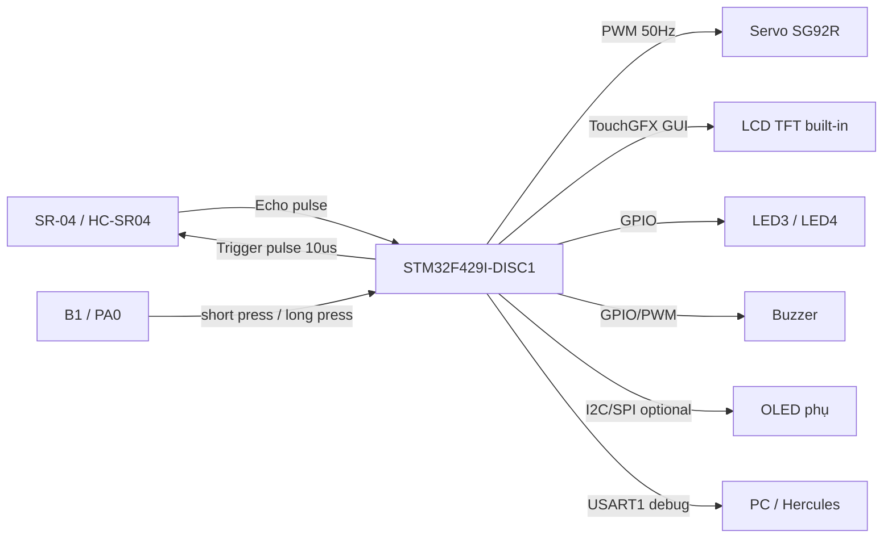
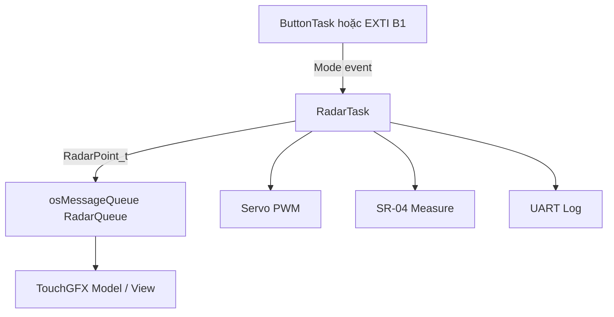
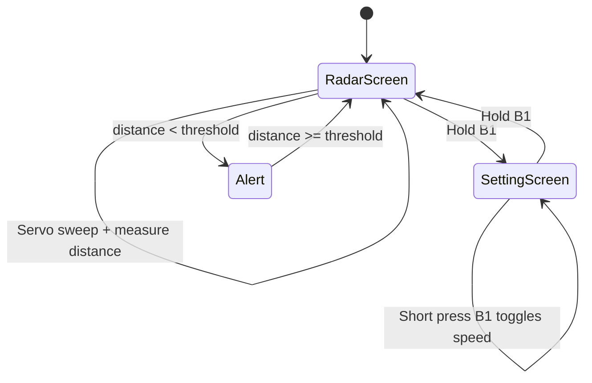

# Kế hoạch bài tập lớn IT4210 – Radar tầm ngắn trên STM32F429I-DISC1

## 1. Chốt đề tài

**Tên đề tài:** Radar tầm ngắn  
**Nhóm:** chatgpt  
**Board chính:** STM32F429I-DISC1  
**MCU:** STM32F429ZIT6  
**Workflow:** STM32CubeMX riêng + STM32CubeIDE riêng + TouchGFX Designer  
**Hướng làm:** dùng board STM32F429I-DISC1 làm bộ xử lý trung tâm, điều khiển servo quay cảm biến siêu âm, đo khoảng cách theo góc quét, hiển thị dạng radar lên màn hình LCD cảm ứng tích hợp của board bằng TouchGFX. Có thể bổ sung OLED mượn thầy để hiển thị số liệu phụ.

## 2. Yêu cầu gốc trong file bài tập lớn

Đề tài **Radar tầm ngắn** có các yêu cầu chính:

1. Cảm biến đo khoảng cách tới vật cản.
2. Có động cơ điều khiển radar quay 90° hoặc 180°.
3. Hiển thị số liệu quét radar lên màn hình.
4. Bấm và giữ nút B1 để chuyển sang màn hình thiết lập tốc độ quay servo. Bấm nút B1 để chọn tốc độ quay chậm / nhanh.

Linh kiện gợi ý trong file:

- SR-04 / HC-SR04: cảm biến siêu âm đo khoảng cách.
- Động cơ Servo SG92R: quay cảm biến.
- Màn hình OLED 0.96 inch SPI: hiển thị số liệu phụ.
- ESP32 / Uno là gợi ý gốc, nhưng nhóm mình sẽ thay bằng **STM32F429I-DISC1** vì đúng context học/lab và có sẵn màn hình TouchGFX.

## 3. Mục tiêu sản phẩm nhóm mình nên làm

### 3.1. Bản tối thiểu phải chạy

- Servo SG92R quay cảm biến SR-04 từ 0° đến 180°, sau đó quét ngược lại.
- Tại mỗi góc, STM32 đo khoảng cách bằng SR-04.
- LCD TouchGFX hiển thị:
  - góc hiện tại,
  - khoảng cách hiện tại,
  - điểm vật cản trên màn hình radar,
  - trạng thái tốc độ servo: SLOW / FAST.
- Nút B1:
  - bấm thường: đổi tốc độ chậm / nhanh,
  - giữ lâu: chuyển màn hình chính ↔ màn hình cài đặt.
- LED3 / LED4 trên board báo trạng thái:
  - LED3 nháy khi đang quét,
  - LED4 bật/cảnh báo khi vật cản gần hơn ngưỡng.

### 3.2. Bản đẹp hơn để báo cáo/thuyết trình tốt

- Có giao diện radar dạng cung quét 180° trên LCD TouchGFX.
- Có đường quét xanh/đường quét động theo góc servo.
- Có điểm đỏ/vàng biểu diễn vật cản gần.
- Có buzzer báo khi khoảng cách nhỏ hơn ngưỡng nguy hiểm.
- Có OLED phụ hiển thị số liệu nhanh: `Angle`, `Distance`, `Speed`, `Alert`.
- Có UART log về PC để debug và quay video minh chứng:
  - `ANGLE=045 DIST=031cm SPEED=SLOW ALERT=0`
  - `ANGLE=090 DIST=008cm SPEED=FAST ALERT=1`

## 4. Danh sách linh kiện đề xuất

### 4.1. Linh kiện bắt buộc

| STT | Linh kiện | Vai trò | Ghi chú |
|---:|---|---|---|
| 1 | STM32F429I-DISC1 | Bộ xử lý trung tâm, hiển thị TouchGFX, đọc nút, điều khiển PWM/timer | Dùng đúng board nhóm đang có |
| 2 | SR-04 / HC-SR04 | Đo khoảng cách vật cản | Echo 5V cần hạ áp về 3.3V trước khi vào STM32 |
| 3 | Servo SG92R | Quay cảm biến theo góc 0–180° hoặc 0–90° | Nên cấp nguồn 5V riêng/chắc dòng, GND chung với STM32 |
| 4 | Màn hình TFT LCD tích hợp trên board | Hiển thị radar chính bằng TouchGFX | Không cần mượn thêm nếu dùng được LCD |
| 5 | Nút B1 trên board | Đổi chế độ / tốc độ quét | PA0 trên board, cần xử lý bấm ngắn và giữ lâu |

### 4.2. Linh kiện nên thêm để đủ “hơn 3 linh kiện” và thực tế hơn

| STT | Linh kiện | Vai trò | Có nên dùng không? |
|---:|---|---|---|
| 6 | OLED SH1106 / OLED 0.96 inch | Màn phụ hiển thị số góc/khoảng cách | Nên dùng nếu mượn thầy được, giúp sản phẩm nhiều phần cứng hơn |
| 7 | Buzzer 3.3V/5V | Cảnh báo vật cản gần | Rất nên dùng, dễ demo |
| 8 | Điện trở chia áp 1k + 2k hoặc 10k + 20k | Hạ Echo từ 5V xuống khoảng 3.3V | Bắt buộc để an toàn cho GPIO STM32 |
| 9 | Nguồn 5V ngoài / adapter USB tốt | Cấp servo ổn định | Servo không nên lấy dòng yếu từ chân 3V3 |
| 10 | Breadboard, dây Dupont, keo nến/giá đỡ | Gắn SR-04 lên servo | Cần cho demo thật |

## 5. Kiến trúc hệ thống



## 6. Gợi ý phân công nhiệm vụ trong nhóm

| Thành viên | Việc chính | Đầu ra cần có |
|---|---|---|
| Nguyễn Minh Giang | Driver SR-04 + đo khoảng cách + lọc nhiễu | `hcsr04.c/.h`, test UART khoảng cách |
| Bùi Trung Hoàng | Servo PWM + thuật toán quét góc | `servo.c/.h`, servo quay 0–180 ổn định |
| Phạm Ngọc Hưng | TouchGFX giao diện radar + màn cài đặt | `Screen1View`, `Screen2View`, demo radar |
| Khương Anh Tài | Tích hợp hệ thống + UART log + báo cáo GitHub | main integration, README/report, video demo |

Có thể đổi tên/người theo thực tế, nhưng nên chia như vậy để báo cáo có phần “Công việc” rõ.

## 7. Thiết kế phần cứng dự kiến

> Lưu ý: pin dưới đây là bản đề xuất ban đầu. Khi tạo project thật trong CubeMX cần kiểm tra lại với TouchGFX/LTDC/FMC để tránh trùng chân LCD/SDRAM. Không tự đổi pin khi chưa kiểm tra `.ioc`.

| Khối | Tín hiệu | STM32F429I-DISC1 | Chức năng CubeMX | Ghi chú |
|---|---|---|---|---|
| SR-04 | TRIG | 1 GPIO Output tự do | GPIO_Output | Xuất xung 10us |
| SR-04 | ECHO | 1 GPIO Input tự do hoặc Timer Input Capture | GPIO_Input / TIMx_CHy | Bắt buộc qua chia áp 5V → 3.3V |
| Servo SG92R | Signal | 1 chân Timer PWM | TIMx_CHy PWM Generation | 50Hz, pulse 0.5–2.5ms |
| Servo SG92R | VCC | 5V | Nguồn | Nên dùng nguồn ngoài hoặc 5V ổn định |
| Servo SG92R | GND | GND chung | GND | Phải nối chung GND với STM32 |
| B1 | PA0 | GPIO Input | GPIO_EXTI hoặc polling | Có sẵn trên board |
| LED3 | PG13 | GPIO Output | GPIO_Output | Báo đang quét |
| LED4 | PG14 | GPIO Output | GPIO_Output | Báo vật cản gần |
| OLED phụ | SCL/SDA hoặc SPI | tùy module | I2C/SPI | Nếu dùng SH1106 có thể tận dụng kinh nghiệm lab02 |
| UART debug | USART1 | theo cấu hình lab | USART1 115200 | Gửi log về Hercules |

## 8. Nguyên lý đo khoảng cách SR-04

1. STM32 kéo chân TRIG lên mức 1 trong khoảng 10 micro giây.
2. SR-04 phát sóng siêu âm.
3. Khi nhận phản xạ, SR-04 trả về xung ECHO.
4. Độ rộng xung ECHO tỷ lệ với quãng đường đi-về của sóng âm.
5. Khoảng cách tính gần đúng:

```text
distance_cm = echo_time_us / 58
```

Cần lọc nhiễu bằng cách:

- Nếu không có echo sau timeout khoảng 25–30 ms thì coi là ngoài vùng đo.
- Mỗi góc có thể đo 2–3 lần rồi lấy trung bình hoặc lấy median.
- Giới hạn hiển thị, ví dụ chỉ quan tâm 2 cm đến 200 cm.

## 9. Nguyên lý điều khiển servo SG92R

Servo thường dùng PWM 50 Hz, chu kỳ 20 ms.

| Góc | Độ rộng xung tham khảo |
|---:|---:|
| 0° | khoảng 0.5 ms |
| 90° | khoảng 1.5 ms |
| 180° | khoảng 2.5 ms |

Cần hiệu chỉnh thực tế vì mỗi servo có sai số. Nên viết hàm:

```c
void Servo_SetAngle(uint8_t angle);
```

Hàm này đổi `angle` thành `pulse width` rồi set CCR của timer PWM.

## 10. Mô hình phần mềm đề xuất

### 10.1. Các module code nên tách riêng

```text
Core/Inc/hcsr04.h
Core/Src/hcsr04.c
Core/Inc/servo.h
Core/Src/servo.c
Core/Inc/radar_app.h
Core/Src/radar_app.c
Core/Inc/radar_types.h
```

Nếu dùng OLED phụ:

```text
Core/Inc/sh1106.h
Core/Src/sh1106.c
Core/Inc/fonts.h
Core/Src/fonts.c
```

Nếu dùng buzzer:

```text
Core/Inc/buzzer.h
Core/Src/buzzer.c
```

### 10.2. Cấu trúc dữ liệu chính

```c
typedef enum {
    RADAR_SPEED_SLOW = 0,
    RADAR_SPEED_FAST = 1
} RadarSpeed_t;

typedef struct {
    uint16_t angle_deg;
    uint16_t distance_cm;
    uint8_t valid;
    uint8_t alert;
} RadarPoint_t;

typedef struct {
    RadarSpeed_t speed;
    uint16_t current_angle;
    int8_t direction;
    uint16_t min_angle;
    uint16_t max_angle;
    uint16_t alert_threshold_cm;
    RadarPoint_t points[181];
} RadarState_t;
```

## 11. FreeRTOS / TouchGFX hướng tích hợp

Nên dùng mô hình có queue để tách phần cứng và giao diện:



### Task đề xuất

| Task | Chu kỳ | Việc làm |
|---|---:|---|
| `RadarTask` | tùy tốc độ | Set góc servo, chờ ổn định, đo distance, gửi queue |
| `ButtonTask` | 20 ms | Đọc B1, phân biệt bấm ngắn/giữ lâu |
| `TouchGFXTask` | do TouchGFX sinh | Nhận dữ liệu radar và vẽ lại màn hình |
| `UartLogTask` hoặc gửi trực tiếp | 100–300 ms | In trạng thái về Hercules |

Nếu muốn đơn giản hơn, giai đoạn đầu có thể chưa dùng nhiều task: chạy radar trong main loop hoặc 1 task chính, sau đó mới ghép TouchGFX.

## 12. Thiết kế giao diện TouchGFX

### Screen 1 – Radar View

Nội dung:

- Tiêu đề: `SHORT RANGE RADAR`.
- Vùng radar hình bán nguyệt 180°.
- Đường quét quay theo góc servo.
- Điểm vật cản theo khoảng cách.
- Text:
  - `Angle: xxx deg`
  - `Distance: xxx cm`
  - `Speed: SLOW/FAST`
  - `Alert: SAFE/NEAR`
- Nút mềm optional:
  - `Speed`
  - `Clear`
  - `Settings`

### Screen 2 – Speed Setting

Nội dung:

- `Servo Speed Setting`
- Hiển thị mode hiện tại: `SLOW` hoặc `FAST`.
- Hướng dẫn: `Press B1 to toggle. Hold B1 to return.`
- Có thể thêm slider/2 button mềm nếu dùng cảm ứng.

## 13. Luồng hoạt động sản phẩm



## 14. Kế hoạch triển khai theo từng mốc

### Mốc 1 – Test riêng SR-04

Mục tiêu:

- STM32 đo được khoảng cách và in UART.

Việc làm:

1. Tạo project mới `radar_short_range_step1_hcsr04`.
2. Cấu hình clock 180 MHz như các lab trước.
3. Cấu hình USART1 115200.
4. Cấu hình 1 timer chạy 1 MHz để đo micro giây.
5. Cấu hình TRIG output, ECHO input.
6. Viết `hcsr04.c/.h`.
7. Test bằng Hercules.

Kết quả mong muốn:

```text
DIST=034 cm
DIST=035 cm
DIST=033 cm
```

### Mốc 2 – Test riêng Servo

Mục tiêu:

- Servo quay được 0°, 90°, 180°.

Việc làm:

1. Tạo project hoặc nhánh `radar_short_range_step2_servo`.
2. Cấu hình 1 timer PWM 50 Hz.
3. Viết `servo.c/.h`.
4. Cho servo lần lượt quay 0 → 90 → 180 → 90 → 0.

Kết quả mong muốn:

- Servo quay êm, không giật quá mạnh.
- Không reset board khi servo chạy.

### Mốc 3 – Ghép Servo + SR-04

Mục tiêu:

- Quét góc và đo khoảng cách theo từng góc.

Việc làm:

1. Servo quét từ 0 đến 180, bước 2° hoặc 5°.
2. Sau mỗi lần set góc, delay ngắn để servo ổn định.
3. Đo khoảng cách.
4. In UART dạng:

```text
ANGLE=000 DIST=120cm
ANGLE=005 DIST=118cm
ANGLE=010 DIST=095cm
```

### Mốc 4 – Thêm B1 + LED cảnh báo

Mục tiêu:

- Đủ yêu cầu điều khiển tốc độ.

Việc làm:

1. B1 bấm ngắn: đổi `SLOW/FAST`.
2. B1 giữ lâu: chuyển trạng thái màn hình/cài đặt.
3. LED3 nháy mỗi lần quét.
4. LED4 bật nếu distance dưới ngưỡng, ví dụ 20 cm.

### Mốc 5 – TouchGFX màn radar

Mục tiêu:

- Có giao diện đẹp trên LCD tích hợp.

Việc làm:

1. Tạo project TouchGFX trên STM32F429I-DISC1.
2. Thiết kế `ScreenRadar` và `ScreenSetting`.
3. Dùng queue truyền `RadarPoint_t` từ task phần cứng sang TouchGFX.
4. Trong `handleTickEvent()` hoặc Model, cập nhật đường quét/điểm vật cản.

### Mốc 6 – OLED phụ + Buzzer

Mục tiêu:

- Sản phẩm có nhiều linh kiện, dễ demo, thực tế hơn.

Việc làm:

1. Nếu dùng SH1106 I2C, tái sử dụng kinh nghiệm lab02.
2. OLED hiển thị số liệu nhanh.
3. Buzzer kêu ngắn khi vật cản gần.

### Mốc 7 – Hoàn thiện GitHub + báo cáo

Mục tiêu:

- Có repo đúng format báo cáo.

Việc làm:

1. Tạo repo GitHub.
2. Thư mục nên có:

```text
README.md
/Core
/Drivers
/TouchGFX
/images
/videos hoặc link video demo
/docs
```

3. README theo khung:
   - Giới thiệu.
   - Tác giả.
   - Môi trường hoạt động.
   - Hướng dẫn cài đặt và chạy thử.
   - Nguyên lý cơ bản.
   - Tích hợp hệ thống.
   - Thuật toán quét radar.
   - Sơ đồ nối dây.
   - Đặc tả hàm.
   - Lỗi phát sinh.
   - Kết quả.

## 15. Rủi ro kỹ thuật và cách xử lý

| Rủi ro | Nguyên nhân | Cách xử lý |
|---|---|---|
| STM32 bị reset khi servo chạy | Servo ăn dòng lớn | Dùng nguồn 5V riêng, nối GND chung |
| GPIO STM32 hỏng | Echo SR-04 là 5V | Dùng chia áp 1k/2k hoặc 10k/20k |
| Đo khoảng cách nhảy loạn | Echo nhiễu, vật cản lệch, servo rung | Lấy trung bình/median 3 mẫu, delay servo ổn định |
| TouchGFX bị trắng màn | Sai cấu hình LTDC/FMC/SDRAM hoặc project chưa sync | Bám project TouchGFX đã từng build sạch, không đổi bừa object |
| B1 khó phân biệt bấm/giữ | Không debounce | Dùng state machine + thời gian giữ > 800 ms |
| Không đủ chân khi dùng LCD | TouchGFX chiếm nhiều chân | Chọn chân ngoại vi sau khi kiểm tra `.ioc`, ưu tiên GPIO header chưa dùng |

## 16. Phần báo cáo cần chuẩn bị sớm

Dựa theo ProjectSample, nhóm cần chuẩn bị sớm các ảnh/video sau:

1. Ảnh tổng thể sản phẩm: board + servo + SR-04 + OLED/buzzer.
2. Ảnh sơ đồ nối dây hoặc bảng nối dây.
3. Ảnh màn hình TouchGFX radar khi quét.
4. Ảnh màn hình cài đặt tốc độ.
5. Ảnh Hercules log nếu có UART.
6. Video demo:
   - quét không có vật cản,
   - đưa tay/vật cản lại gần,
   - LED/buzzer cảnh báo,
   - bấm B1 đổi tốc độ.

## 17. Kết luận hướng làm nên chọn

Hướng phù hợp nhất cho nhóm mình:

- **Không dùng ESP32/Uno** dù sheet gợi ý, vì nhóm đang có STM32F429I-DISC1 và đã có kinh nghiệm TouchGFX.
- Dùng **LCD TouchGFX tích hợp** làm giao diện chính để đề tài nổi bật hơn bản OLED đơn giản.
- Dùng **SR-04 + SG92R + B1 + LED3/LED4 + buzzer + OLED phụ** để vừa đáp ứng yêu cầu, vừa đủ nhiều linh kiện, vừa dễ demo thực tế.
- Làm theo từng mốc nhỏ: đo khoảng cách trước, servo sau, ghép quét, rồi mới đưa lên TouchGFX.

